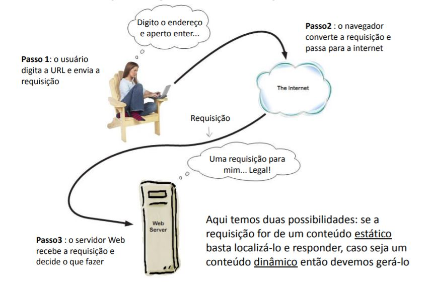
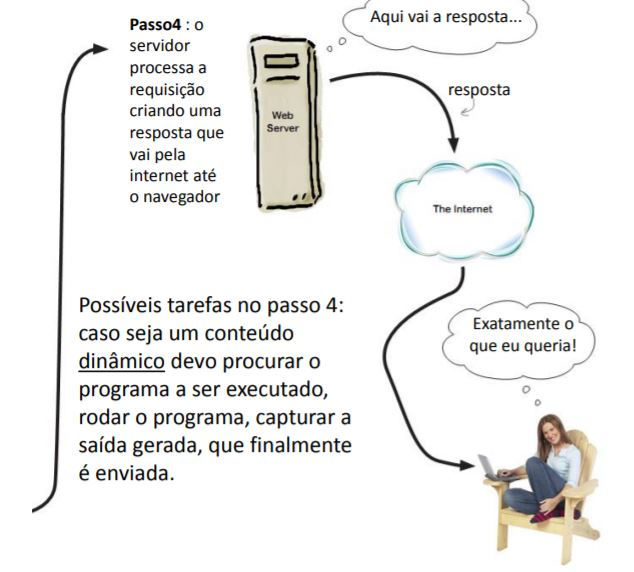

Desarrollo web
==============

Solicitudes y respuestas
------------------------

+ "Python: el único lenguaje con más marcos web que palabras clave"
+ Frameworks: Plone, Django, Web2py, Pyramid
+ Micro Frameworks: CherryPy, Botella, Frasco
+ WSGI (interfaz de puerta de enlace del servidor web)

  + Patrones de acceso y comunicación entre servidores web y aplicaciones Python
  + No es J2EE ;-)

Web2py
------

+ InfoWorld: best full-stack Python framework
+ Bossie: Best Open Source Development Software
+ MVC:

  + Modelo: datos
  + Controladores: reglas de negocio
  + Vistas: presentación

+ Autocontido == full-stack framework
+ Seguro
+ DAL (Data Access Layer)
+ Deploy rápido e distribuição fácil
+ Princípios Python

  + DRY – Don’t Repeat Yourself
  + Debe haber solo una forma obvia de hacer algo
  + Explícito es mejor que implícito (no sigue)
