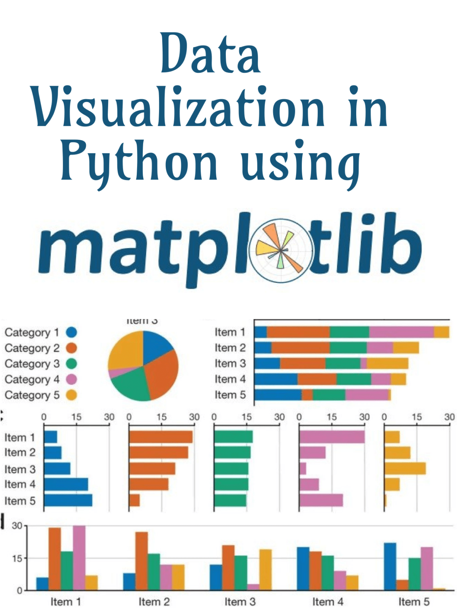

==================================================
Dominando la Visualización de Datos con Matplotlib
==================================================

Introducción
------------
Esta serie de conferencias se enfoca en dominar Matplotlib, una de las bibliotecas más populares en Python para la visualización de datos. Exploraremos varias funcionalidades de Matplotlib, entendiendo cómo crear una amplia gama de gráficos para comunicar eficazmente los insights de los datos.

Parte 1: Entendiendo los Fundamentos de Matplotlib
--------------------------------------------------

.. contents::
   :local:

Descripción General
~~~~~~~~~~~~~~~~~~~
Matplotlib es una biblioteca integral para crear visualizaciones estáticas, animadas e interactivas en Python. Proporciona una interfaz de bajo nivel para crear una variedad de gráficos, dándote control total sobre cada aspecto de la figura.

Instalando Matplotlib
~~~~~~~~~~~~~~~~~~~~~
Instala Matplotlib usando pip::

    pip install matplotlib

Importando Matplotlib
~~~~~~~~~~~~~~~~~~~~~
Importa Matplotlib en tu script de Python::

    import matplotlib.pyplot as plt

Creando Gráficos Básicos
~~~~~~~~~~~~~~~~~~~~~~~~
**Gráfico de Líneas**::

    # Datos de Ejemplo
    x = [1, 2, 3, 4, 5]
    y = [10, 20, 25, 30, 35]

    # Gráfico
    plt.plot(x, y)
    plt.title('Ejemplo de Gráfico de Líneas')
    plt.xlabel('Eje X')
    plt.ylabel('Eje Y')
    plt.show()

**Gráfico de Barras**::

    # Datos de Ejemplo
    categorías = ['A', 'B', 'C', 'D']
    valores = [4, 7, 1, 8]

    # Gráfico
    plt.bar(categorías, valores)
    plt.title('Ejemplo de Gráfico de Barras')
    plt.xlabel('Categorías')
    plt.ylabel('Valores')
    plt.show()

**Gráfico de Dispersión**::

    # Datos de Ejemplo
    x = [5, 7, 8, 7, 2, 17, 2, 9, 4, 11, 12, 9, 6]
    y = [99, 86, 87, 88, 100, 86, 103, 87, 94, 78, 77, 85, 86]

    # Gráfico
    plt.scatter(x, y)
    plt.title('Ejemplo de Gráfico de Dispersión')
    plt.xlabel('Eje X')
    plt.ylabel('Eje Y')
    plt.show()

Parte 2: Técnicas Avanzadas de Graficación
------------------------------------------

.. contents::
   :local:

Histogramas
~~~~~~~~~~~
**Histograma**::

    # Datos de Ejemplo
    datos = [1, 2, 2, 3, 3, 3, 4, 4, 4, 4]

    # Gráfico
    plt.hist(datos, bins=4)
    plt.title('Ejemplo de Histograma')
    plt.xlabel('Intervalos de Datos')
    plt.ylabel('Frecuencia')
    plt.show()

Gráficos de Caja
~~~~~~~~~~~~~~~~
**Gráfico de Caja**::

    # Datos de Ejemplo
    datos = [1, 2, 3, 4, 5, 6, 7, 8, 9, 10]

    # Gráfico
    plt.boxplot(datos)
    plt.title('Ejemplo de Gráfico de Caja')
    plt.ylabel('Valores')
    plt.show()

Gráficos de Pastel
~~~~~~~~~~~~~~~~~~
**Gráfico de Pastel**::

    # Datos de Ejemplo
    etiquetas = 'A', 'B', 'C', 'D'
    tamaños = [15, 30, 45, 10]
    colores = ['gold', 'yellowgreen', 'lightcoral', 'lightskyblue']

    # Gráfico
    plt.pie(tamaños, labels=etiquetas, colors=colores, autopct='%1.1f%%', startangle=140)
    plt.title('Ejemplo de Gráfico de Pastel')
    plt.show()

Parte 3: Personalización de Gráficos
------------------------------------

.. contents::
   :local:

Añadiendo Cuadrícula
~~~~~~~~~~~~~~~~~~~~
Añadir cuadrícula a tu gráfico::

    plt.plot(x, y)
    plt.grid(True)
    plt.show()

Cambiando Estilos y Colores de Línea
~~~~~~~~~~~~~~~~~~~~~~~~~~~~~~~~~~~~
Cambiar estilo y color de línea::

    plt.plot(x, y, linestyle='--', color='r')
    plt.show()

Añadiendo Anotaciones
~~~~~~~~~~~~~~~~~~~~~
Añadir anotaciones a tu gráfico::

    plt.plot(x, y)
    plt.annotate('Punto más Alto', xy=(4, 30), xytext=(3, 35),
                 arrowprops=dict(facecolor='black', shrink=0.05))
    plt.show()

Parte 4: Aplicaciones y Estudios de Caso en el Mundo Real
----------------------------------------------------------

.. contents::
   :local:

Análisis de Datos de Salud
~~~~~~~~~~~~~~~~~~~~~~~~~~
- Visualizar tiempos de espera de pacientes usando histogramas.
- Analizar distribución de servicios con gráficos de barras.

Análisis de Datos Financieros
~~~~~~~~~~~~~~~~~~~~~~~~~~~~~
- Visualizar tendencias del mercado de valores con gráficos de líneas.
- Analizar el desempeño de la cartera usando gráficos de dispersión.

Análisis de Datos de Redes Sociales
~~~~~~~~~~~~~~~~~~~~~~~~~~~~~~~~~~~
- Realizar análisis de sentimiento con gráficos de barras.
- Detectar tendencias usando visualizaciones de series temporales.

Parte 5: Mejores Prácticas para la Visualización de Datos
---------------------------------------------------------

.. contents::
   :local:

Claridad
~~~~~~~~
Asegúrate de que tu visualización sea fácil de entender.

Precisión
~~~~~~~~~
Representa los datos con precisión sin inducir a error.

Estética
~~~~~~~~
Usa color y diseño de manera efectiva, pero evita complicar demasiado.

Contexto
~~~~~~~~
Proporciona contexto con títulos, etiquetas y leyendas.

Parte 6: Ejemplo
----------------

.. contents::
   :local:

Aquí hay un ejemplo de visualización de datos de ventas usando Matplotlib. El ejemplo usa datos de ventas de un archivo CSV y luego los visualiza usando varios tipos de gráficos.

.. activecode:: ac_l68_1a
   :nocodelens:
   :language: python3
   :python3_interpreter: pyscript

   import pandas as pd
   import matplotlib.pyplot as plt

   from pyscript import display

   # Datos de Ejemplo
   datos_ventas = pd.DataFrame({
       'clase': ['Primera', 'Segunda', 'Tercera', 'Primera', 'Segunda', 'Tercera', 'Primera', 'Segunda', 'Tercera', 'Primera', 'Segunda', 'Tercera', 'Primera', 'Segunda', 'Tercera'],
       'tarifa': [71.2833, 10.5, 7.25, 53.1, 8.05, 7.8542, 51.8625, 21.0, 11.1333, 26.55, 31.275, 7.8542, 61.3792, 14.4542, 7.7417]
   })

   # Crear el gráfico
   fig, ax = plt.subplots(figsize=(10, 6))
   ax.bar(datos_ventas['clase'], datos_ventas['tarifa'], color='skyblue')
   ax.set_title("Visualización de Datos de Ventas")
   ax.set_xlabel("Clase")
   ax.set_ylabel("Tarifa")

   # Mostrar el gráfico
   display(fig)

.. activecode:: ac_l68_1b
   :nocodelens:
   :language: python3
   :python3_interpreter: pyscript

   import matplotlib.pyplot as plt
   import matplotlib.tri as tri
   import numpy as np

   from pyscript import display

   # Primero, crear las coordenadas x e y de los puntos.
   n_ángulos = 36
   n_radios = 8
   radio_min = 0.25
   radios = np.linspace(radio_min, 0.95, n_radios)

   ángulos = np.linspace(0, 2 * np.pi, n_ángulos, endpoint=False)
   ángulos = np.repeat(ángulos[..., np.newaxis], n_radios, axis=1)
   ángulos[:, 1::2] += np.pi / n_ángulos

   x = (radios * np.cos(ángulos)).flatten()
   y = (radios * np.sin(ángulos)).flatten()
   z = (np.cos(radios) * np.cos(3 * ángulos)).flatten()

   # Crear la Triangulación; sin triángulos, se crea una triangulación Delaunay.
   triang = tri.Triangulation(x, y)

   # Enmascarar triángulos no deseados.
   triang.set_mask(np.hypot(x[triang.triangles].mean(axis=1),
                               y[triang.triangles].mean(axis=1))
                   < radio_min)

   fig1, ax1 = plt.subplots()
   ax1.set_aspect('equal')
   tpc = ax1.tripcolor(triang, z, shading='flat')
   fig1.colorbar(tpc)
   ax1.set_title("tripcolor de la triangulación de Delaunay, sombreado plano")

   display(fig1)