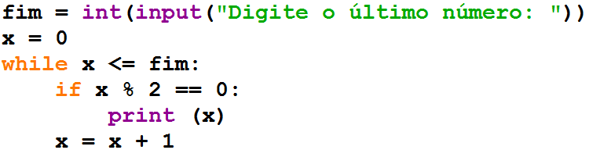

Repetições
==========

.. image:: img/TWP10_001.jpeg
   :height: 14.925cm
   :width: 9.258cm
   :alt: 

<número>

Repetições
==========

.. image:: img/TWP15_001.png
   :height: 15.602cm
   :width: 16.801cm
   :alt: 

.. image:: img/TWP15_002.jpeg
   :height: 19.049cm
   :width: 12.668cm
   :alt: 

Imprimindo de 1 a 3
===================

+ Forma simples

+ Usando uma variável

.. image:: img/TWP15_003.png
   :height: 2.724cm
   :width: 4.603cm
   :alt: 

.. image:: img/TWP15_004.png
   :height: 5.582cm
   :width: 4.55cm
   :alt: 

Imprimindo de 1 a 3
===================

+ Incrementando a variável

+ Usando while

.. image:: img/TWP15_005.png
   :height: 5.21cm
   :width: 4.6cm
   :alt: 

.. image:: img/TWP15_006.png
   :height: 3.677cm
   :width: 6.64cm
   :alt: 

.. image:: img/TWP15_007.png
   :height: 14.804cm
   :width: 22.181cm
   :alt: 

Imprimindo de 1 a 3
===================

.. image:: img/TWP15_006.png
   :height: 3.399cm
   :width: 6.139cm
   :alt: 

Teste de mesa
=============

x

Tela

1

1

2

2

3

3

4

..  image type unrecognized: data:image/*;base64,VkNMTVRGAQAxAAAAAAAAAAEAGwAAAAAAAAAAAAAA

Contadores
==========

+ Agora imprima de 1 até um número digitado pelo usuário

.. image:: img/TWP15_008.png
   :height: 4.391cm
   :width: 20.16cm
   :alt: 

Contadores
==========

+ Imprimir os números pares entre 0 e um número fornecido usando if

Contadores
==========

+ Imprimir os números pares entre 0 e um número fornecido sem utilizar
  o if

.. image:: img/TWP15_010.png
   :height: 4.735cm
   :width: 20.081cm
   :alt: 

Contadores
==========

+ Modifique o programa anterior para imprimir de 1 até o número
  digitado pelo usuário, mas dessa vez apenas os números ímpares
+ Reescreva o programa anterior para escrever os 10 primeiros
  múltiplos de 3

Acumuladores
============

+ A diferença entre um contador e um acumulador é que nos contadores o
  valor adicionado é constante e, nos acumuladores, variável
+ Cálculo da soma de dez números inteiros

.. image:: img/TWP15_011.png
   :height: 6.217cm
   :width: 20.398cm
   :alt: 

Acumuladores
============

+ Calcule a média de 10 números inteiros

.. image:: img/TWP15_012.png
   :height: 6.296cm
   :width: 20.557cm
   :alt: 

Acumuladores
============

+ Calcule o fatorial de dez

.. image:: img/TWP15_013.png
   :height: 5.37cm
   :width: 12.673cm
   :alt: 

Acumuladores
============

+ Calcule o fatorial de um número inteiro n

.. image:: img/TWP15_014.png
   :height: 6.243cm
   :width: 15.08cm
   :alt: 

Interrompendo a repetição
=========================

+ Calcule a soma de números inteiros até ser digitado zero

.. image:: img/TWP15_015.png
   :height: 6.243cm
   :width: 21.272cm
   :alt: 

Interrompendo a repetição
=========================

+ Calcule a média de números até ser digitado zero

.. image:: img/TWP15_016.png
   :height: 8.81cm
   :width: 21.351cm
   :alt: 

Repetições aninhadas
====================

+ Imprima as tabuadas de 1 a 10

.. image:: img/TWP15_017.png
   :height: 7.937cm
   :width: 19.128cm
   :alt: 

Lista de Exercícios “again”
===========================

.. image:: img/TWP05_041.jpeg
   :height: 12.571cm
   :width: 9.411cm
   :alt: 

