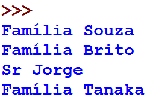

Listas
======

.. image:: img/TWP10_001.jpeg
   :height: 14.925cm
   :width: 9.258cm
   :alt: 

<número>

Edifício
========

+ Edifício de apartamentos

.. image:: img/TWP17_001.png
   :height: 3.412cm
   :width: 16.774cm
   :alt: 

Edifício
========

+ Podemos associar o térreo ao andar zero, o primeiro é o andar 1 e
  assim por diante

.. image:: img/TWP17_002.png
   :height: 6.597cm
   :width: 12.4cm
   :alt: 

Trem de dados
=============

.. image:: img/TWP17_004.png
   :height: 12.8cm
   :width: 16.244cm
   :alt: 

Trem de dados
=============

.. image:: img/TWP17_005.png
   :height: 8.2cm
   :width: 24.756cm
   :alt: 

Posso engatar vagões
====================

.. image:: img/TWP17_006.png
   :height: 10cm
   :width: 25.303cm
   :alt: 

Posso engatar vagões com append
===============================

.. image:: img/TWP17_007.png
   :height: 8cm
   :width: 24.242cm
   :alt: 

Listas
======

+ Uma lista vazia

+ Uma lista com três notas

+ Acessando uma nota

+ Mudando a primeira nota

.. image:: img/TWP17_008.png
   :height: 1.031cm
   :width: 6.534cm
   :alt: 

.. image:: img/TWP17_009.png
   :height: 0.819cm
   :width: 11.535cm
   :alt: 

.. image:: img/TWP17_010.png
   :height: 1.666cm
   :width: 9.207cm
   :alt: 

.. image:: img/TWP17_011.png
   :height: 2.565cm
   :width: 9.312cm
   :alt: 

Listas
======

+ Calcule a média de 5 notas

.. image:: img/TWP17_012.png
   :height: 6.164cm
   :width: 14.842cm
   :alt: 

Listas
======

+ Faça um programa que leia um vetor de 5 números inteiros e mostre o
  vetor

.. image:: img/TWP17_013.png
   :height: 6.243cm
   :width: 18.123cm
   :alt: 

Listas
======

+ Faça um programa que leia um vetor de dez números reais e mostre-os
  na ordem inversa

.. image:: img/TWP17_014.png
   :height: 8.651cm
   :width: 19.208cm
   :alt: 

Listas
======

+ Faça um programa que leia quatro notas, mostre as notas e a média na
  tela

.. image:: img/TWP17_015.png
   :height: 11.508cm
   :width: 14.657cm
   :alt: 

Listas
======

+ Outra forma de fazer o mesmo

.. image:: img/TWP17_016.png
   :height: 8.651cm
   :width: 14.551cm
   :alt: 

Listas
======

+ Faça um Programa que leia um vetor de 10 caracteres minúsculos, e
  diga quantas consoantes foram lidas.

.. image:: img/TWP17_017.png
   :height: 10.477cm
   :width: 18.784cm
   :alt: 

Lista de Exercícios “again”
===========================

.. image:: img/TWP05_041.jpeg
   :height: 12.571cm
   :width: 9.411cm
   :alt: 

