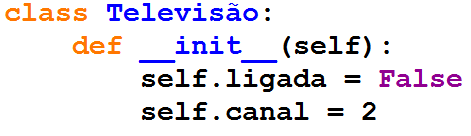
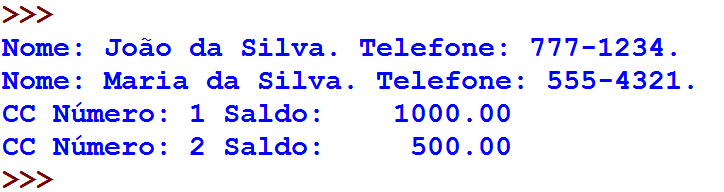
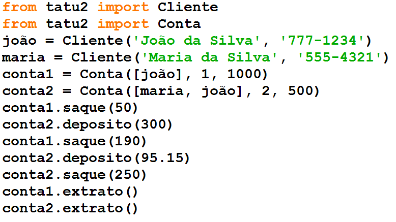

Classes e Objetos
=================

.. image:: img/TWP10_001.jpeg
   :height: 14.925cm
   :width: 9.258cm
   :alt: 

<número>

Baixar os códigos abaixo
========================

+ tv*.py
+ tatu*.py
+ teste*.py

Classes e objetos
=================

+ Classes associam dados (atributos) e operações (métodos) em uma só
  estrutura
+ Um objeto é uma variável cujo tipo é uma classe, ou seja, um objeto
  é uma instância de uma classe
+ Veremos apenas o básico da orientação à objetos

Classes e objetos
=================

.. image:: img/TWP25_001.png
   :height: 5.105cm
   :width: 12.54cm
   :alt: 

.. image:: img/TWP25_002.png
   :height: 1.745cm
   :width: 11.535cm
   :alt: 

Classes e objetos
=================

+ Quando declaramos uma classe, estamos criando um novo tipo de dados
+ Da mesma forma que quando criamos uma lista ou uma string, estamos
  instanciando ou criando uma instância dessas classes
+ É a mesma coisa fazer lista = [] ou lista = list()
+ O método __init__ é chamado construtor e é chamado na criação do
  objeto

Classes e objetos
=================

+ O parâmetro self significa o objeto televisão em si
+ self.ligada é um valor de self, ou seja, do objeto televisão
+ Sempre que criamos atributos do objeto, devemos associá-los a self.
+ Caso contrário, se escrevêssemos apenas ligada = False, ligada seria
  apenas uma variável local do método e não um atributo

Classes e objetos
=================

.. image:: img/TWP25_004.png
   :height: 6.4cm
   :width: 12.679cm
   :alt: 

.. image:: img/TWP25_005.png
   :height: 6.493cm
   :width: 15.201cm
   :alt: 

Classes e objetos
=================

+ Você irá informatizar o banco Tatú, controlando o saldo das contas
  correntes
+ Cada conta corrente pode ter um ou mais clientes como titular
+ O banco controla apenas o nome e telefone
+ A conta corrente apresenta um saldo e um extrato de operações de
  saques e depósitos
+ Não há contas especiais, logo o cliente não pode sacar mais do que
  têm no saldo

Arquivo tatu.py
===============

.. image:: img/TWP25_006.png
   :height: 13.818cm
   :width: 20.763cm
   :alt: 

Arquivo teste.py
================

.. image:: img/TWP25_007.png
   :height: 10.529cm
   :width: 20.345cm
   :alt: 

Saída de teste.py
=================

Extrato de operações
====================

+ Altere o método resumo da classe Conta para extrato, imprimindo
  agora uma lista de operações de saques e depósitos feitas
+ Altere o método __init__ para que utilize o método depósito para
  inicializar o saldo

Arquivo tatu2.py (apenas Conta)
===============================

.. image:: img/TWP25_009.png
   :height: 15.001cm
   :width: 19.682cm
   :alt: 

Arquivo teste2.py
=================

Saída de teste2.py
==================

.. image:: img/TWP25_011.png
   :height: 11.667cm
   :width: 9.868cm
   :alt: 

Herança
=======

+ A orientação a objetos permite modificar nossas classes, adicionando
  ou modificando atributos e métodos, tendo como base a classe anterior
+ Vamos criar contas especiais, onde podemos sacar mais dinheiro que o
  saldo, até um determinado limite
+ As operações depósito, extrato e resumo continuam como uma conta
  normal

Adicionar ContaEspecial tatu3.py
================================

.. image:: img/TWP25_012.png
   :height: 5.976cm
   :width: 22.859cm
   :alt: 

ContaEspecial
=============

+ Observe que escrevemos Conta entre parênteses
+ ContaEspecial herda os métodos e atributos de Conta
+ self.limite será criado apenas para classes do tipo ContaEspecial
+ Observe que estamos substituindo completamente o método saque em
  ContaEspecial

Arquivo teste3.py
=================

.. image:: img/TWP25_013.png
   :height: 11.56cm
   :width: 22.859cm
   :alt: 

Saída teste3.py
===============

.. image:: img/TWP25_014.png
   :height: 11.508cm
   :width: 9.894cm
   :alt: 

Vantagens da herança
====================

+ Modificamos muito pouco o nosso programa, mantendo a funcionalidade
  anterior e adicionando novos recursos
+ Foi possível fazer o reuso dos métodos de Conta
+ Assim a definição da classe ContaEspecial foi bem menor, incluindo
  apenas o comportamento diferente

Outro exemplo OOP
=================

.. image:: img/TWP25_015.png
   :height: 10.4cm
   :width: 24.82cm
   :alt: 

