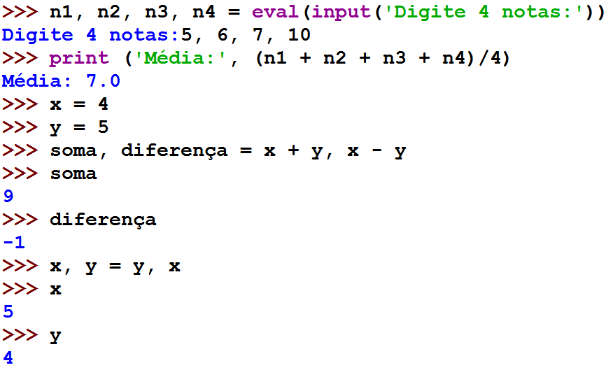
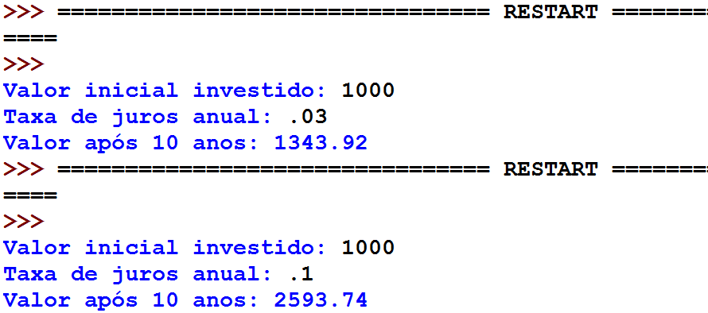

===============
Revisão Geral 3
===============

.. image:: img/TWP10_001.jpeg
   :height: 14.925cm
   :width: 9.258cm
   :alt: 

<número>

O processo de desenvolvimento de software
=========================================

+ Executar programas feitos por outros é uma tarefa relativamente
  simples
+ O difícil é começar a criar seus próprios programas
+ Computadores são muito rigorosos e há muitos detalhes
+ Por isso é necessário ser muito sistemático

Etapas no processo de desenvolvimento de software
=================================================

+ Analisar o problema:

  +

    + –Entender exatamente qual é o problema a ser resolvido
    + –Problema bem definido, meio problema resolvido

+ Especificar o problema:

    + –Descrever exatamente o que o seu programa fará
    + –Nesta etapa não me devo preocupar em como irei fazer meu programa,
      mas em decidir exatamente o que ele fará
    + –Quais são as entradas e saídas do programa?

Etapas no processo de desenvolvimento de software
=================================================

+ Projetar o programa:

  +

    + –Formular a estrutura geral do programa
    + –Podemos usar pseudo-código nesta etapa

+ Implementar o programa:

    + –Elaborar alguns testes para validar o seu programa
    + –Traduzir o projeto em alguma linguagem
    + –Neste curso utilizaremos Python

Exemplo: conversor de temperatura de Fahrenheit para Celsius
============================================================

+ Análise: dada uma temperatura em graus Fahrenheit obter a conversão
  para Celsius
+ Especificação do que o programa fará:

  +

    + –Entrada: temperatura em Fahrenheit
    + –Saída: temperatura em Celsius
    + –Saída: 5*(F-32)/9

Exemplo: conversor de temperatura de Fahrenheit para Celsius
============================================================

+ Projeto do como o programa fará:

  +

    + –Leia o valor da temperatura em Fahrenheit
    + –Converta o valor usando a fórmula 5*(F-32)/9
    + –Imprima o valor convertido

+ Implementação:

    + –Testes: 32 f = 0 c e 100 f = 37.8 c

.. image:: img/TWP40_009.png
   :height: 2.698cm
   :width: 14.154cm
   :alt: 

Variáveis
=========

.. image:: img/TWP40_009.png
   :height: 3.24cm
   :width: 17.001cm
   :alt: 

Uso de variáveis com valores definidos
======================================

.. image:: img/TWP40_009.png
   :height: 3.24cm
   :width: 17.001cm
   :alt: 

Variáveis com valores indefinidos
=================================

.. image:: img/TWP40_010.png
   :height: 6.984cm
   :width: 19.261cm
   :alt: 

Palavras reservadas
===================

.. image:: img/TWP40_009.png
   :height: 3.24cm
   :width: 17.001cm
   :alt: 

Literais ou constantes
======================

.. image:: img/TWP40_009.png
   :height: 3.24cm
   :width: 17.001cm
   :alt: 

Comandos de saída
=================

.. image:: img/TWP40_009.png
   :height: 3.24cm
   :width: 17.001cm
   :alt: 

Caracter de final de linha
==========================

.. image:: img/TWP40_011.png
   :height: 8.651cm
   :width: 17.091cm
   :alt: 

Atribuição de variáveis
=======================

+ <variável> = <expressão>
+ A <expressão> calculada no processador modifica a memória
  referenciada por <variável>

.. image:: img/TWP40_012.png
   :height: 3.999cm
   :width: 20.382cm
   :alt: 

Atribuição de variáveis
=======================

.. image:: img/TWP40_013.png
   :height: 11.27cm
   :width: 8.069cm
   :alt: 

Leitura e atribuição
====================

.. image:: img/TWP40_014.png
   :height: 14.327cm
   :width: 16.201cm
   :alt: 

Atribuição múltipla
===================

Atribuição múltipla
===================

.. image:: img/TWP40_016.png
   :height: 7.778cm
   :width: 12.858cm
   :alt: 

Atribuição múltipla
===================

.. image:: img/TWP40_017.png
   :height: 7.751cm
   :width: 21.033cm
   :alt: 

for <var> in <seqüência>

.. image:: img/TWP40_018.png
   :height: 12.571cm
   :width: 11.676cm
   :alt: 

Exercício
=========

+ Nós queremos desenvolver um programa que determine o valor futuro de
  um investimento, dados o valor inicial e a taxa de juros

Exercício
=========

+ Análise:

  +

    + –Dinheiro inicial rende uma taxa de juros anual
    + –Quanto ele irá valer em 10 anos?
    + –Entrada: valor inicial, taxa de juros
    + –Saída: valor em 10 anos

Exercício
=========

+ Especificação:

  +

    + –Usuário entra com o valor inicial investido
    + –Usuário entra com a taxa de juros anual
    + –Fórmula de matemática financeira valor*(1+juros)

Exercício
=========

+ Projeto:

  +

    + –Entre com o valor do investimento inicial
    + –Entre com a taxa de juros
    + –Repita 10 vezes:

  +

      +

        + valor inicial = valor inicial * (1 + taxa de juros)

    + –Imprima o valor atualizado

Exercício
=========

+ Implementação:

  +

    + –Valores de teste:

  +

      +

        + 1000 reais e 3% de juros
        + 1000 reais e 10% de juros

.. image:: img/TWP40_019.png
   :height: 4.259cm
   :width: 21.695cm
   :alt: 

Exercício
=========

Perguntas
=========

+ Por que definir alguns testes antes da implementação é uma boa
  prática de programação?
+ Qual é a vantagem de escrever um pseudo-código na etapa de projeto?

Números básicos
===============

.. image:: img/TWP40_021.png
   :height: 12.196cm
   :width: 7.672cm
   :alt: 

Tabela de operadores
====================

Operador

Operação

+

Adição

-

Subtração

*

Multiplicação

/

Divisão

**

Exponenciação

abs()

Valor absoluto

%

Resto da divisão

//

Divisão inteira

..  image type unrecognized: data:image/*;base64,VkNMTVRGAQAxAAAAAAAAAAEAGwAAAAAAAAAAAAAA

Operadores Numéricos
====================

.. image:: img/TWP40_022.png
   :height: 12.143cm
   :width: 6.667cm
   :alt: 

.. image:: img/TWP40_023.png
   :height: 10.477cm
   :width: 8.704cm
   :alt: 

Divisão inteira em linguagens antigas
=====================================

+ As linguagens mais antigas geram um resultado inteiro na divisão de
  inteiros!
+ 10 / 3 será igual a 3
+ No cálculo de fahrenheit para celsius terei que modificar um pouco
  meu programa se usar C ou Java

Conversão de graus em C
=======================

.. image:: img/TWP40_024.png
   :height: 9.6cm
   :width: 19.774cm
   :alt: 

