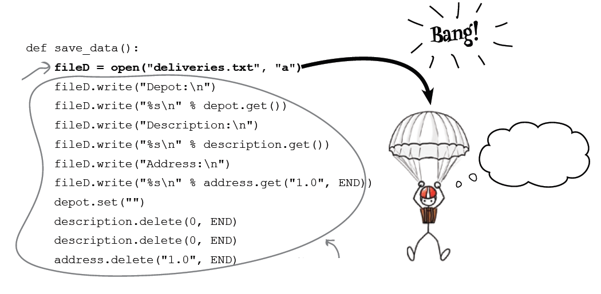

Exceções
========

.. image:: img/TWP10_001.jpeg
   :height: 14.925cm
   :width: 9.258cm
   :alt: 

<número>

Exceções 
=========

.. image:: img/TWP54_001.png
   :height: 14.249cm
   :width: 17.401cm
   :alt: 

Exceções
========

+ Algumas vezes as coisas dão errado. E você precisa tratá-las.
+ Sempre existem coisas que fogem do seu controle. Redes falham.
  Arquivos desaparecem.
+ Códigos inteligentes aprendem a tratar estes erros e fazem com que o
  programa se recupere suavemente.

Que fedor!!
===========

.. image:: img/TWP54_002.png
   :height: 14.477cm
   :width: 12.6cm
   :alt: 

Exceções
========

.. image:: img/TWP54_003.png
   :height: 14.219cm
   :width: 20.601cm
   :alt: 

Exceção é lançada
=================

Capturando a exceção
====================

.. image:: img/TWP54_005.png
   :height: 14.432cm
   :width: 22.771cm
   :alt: 

Tratando exceções
=================

.. image:: img/TWP54_006.png
   :height: 10.339cm
   :width: 22.859cm
   :alt: 

Tratando Exceções
=================

.. image:: img/TWP54_007.png
   :height: 7.611cm
   :width: 22.859cm
   :alt: 

Usando uma messagebox
=====================

.. image:: img/TWP54_008.png
   :height: 10.786cm
   :width: 22.859cm
   :alt: 

Tratando Exceções
=================

.. image:: img/TWP54_009.png
   :height: 8.042cm
   :width: 18.335cm
   :alt: 

Tratando Exceções
=================

.. image:: img/TWP54_010.png
   :height: 15.573cm
   :width: 13.348cm
   :alt: 

