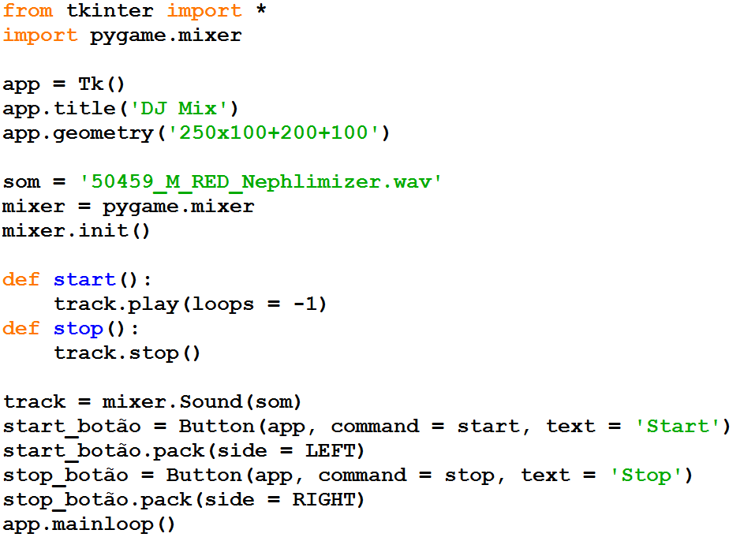
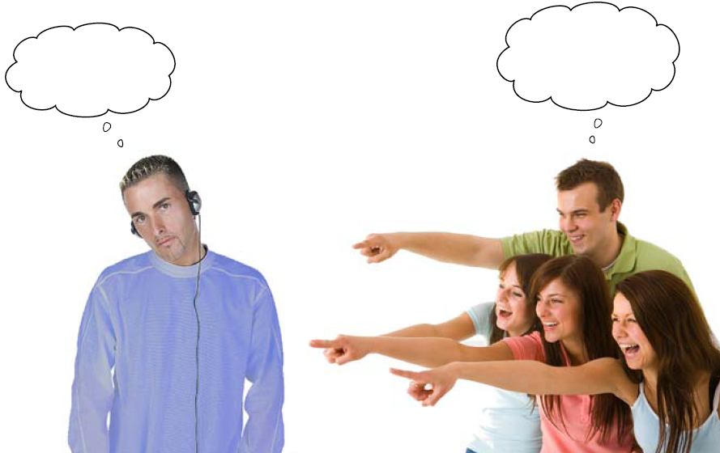

DJ Mix 1
========

.. image:: img/TWP10_001.jpeg
   :height: 14.925cm
   :width: 9.258cm
   :alt: 

<número>

DJ Mix
======

.. image:: img/TWP56_001.png
   :height: 12.571cm
   :width: 14.997cm
   :alt: 

DJ Mix
======

Mas a música não termina...
===========================

.. image:: img/TWP56_004.png
   :height: 2.906cm
   :width: 8.6cm
   :alt: 

DJ Mix
======

DJ Mix
======

.. image:: img/TWP56_005.png
   :height: 15.578cm
   :width: 12.183cm
   :alt: 

.. image:: img/TWP56_006.jpeg
   :height: 4.814cm
   :width: 4.55cm
   :alt: 

DJ Mix
======

.. image:: img/TWP56_007.png
   :height: 12.571cm
   :width: 21.452cm
   :alt: 

.. image:: img/TWP56_008.png
   :height: 11.357cm
   :width: 12cm
   :alt: 

DJ Mix
======

+ Ficou legal, agora vamos colocar um volume!

DJ Mix
======

.. image:: img/TWP56_009.png
   :height: 14.66cm
   :width: 22.825cm
   :alt: 

DJ Mix
======

.. image:: img/TWP56_010.png
   :height: 15.024cm
   :width: 19.401cm
   :alt: 

Recordação
==========

+ app.destroy()
+ DoubleVar()
+ Checkbutton()
+ Scale()

