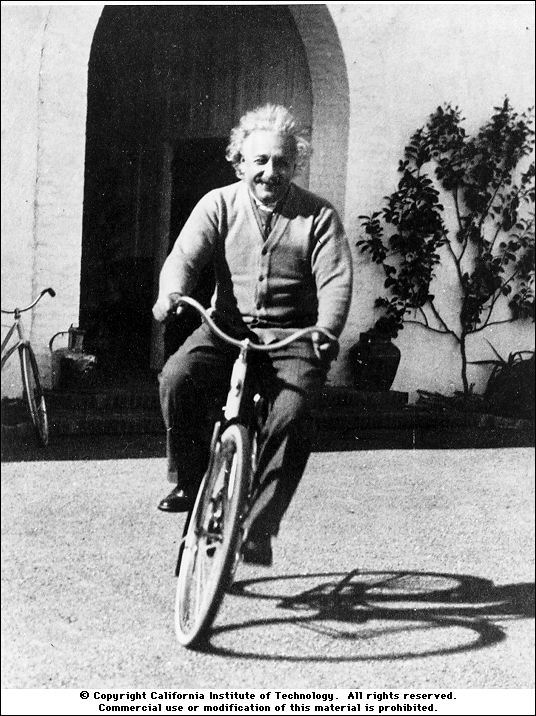

============================
Variáveis e Entrada de Dados
============================

<número>

Primeiro programa
=================

+ Este programa possui apenas uma linha de código
+ Observe que as aspas não aparecem na saída
+ Precisamos marcar ou limitar o início e o fim de nossas mensagens
  com um símbolo, nesse caso, as aspas

.. code-block:: pycon

    >>> print ("hola mundo!")
    hola mundo!

Primeira mensagem de erro
=========================

+ Letras maiúsculas e minúsculas são diferentes
+ Você reparou que Print não está na cor roxa?

.. code-block:: pycon

    >>> Print ("hola mundo!")
    Traceback (most recent call last):
      File "<stdin>", line 1, in <module>
    NameError: name 'Print' is not defined

Primeira mensagem de erro
=========================

+ Se não utilizarmos aspas, o computador interpretará nossa mensagem
  como um comando da linguagem Python, gerando um erro de sintaxe
+ Você reparou que a mensagem não está na cor verde?

.. code-block:: pycon

    >>> print (hola mundo)
      File "<stdin>", line 1
        print (hola mundo)
                        ^
    SyntaxError: invalid syntax

Primeira mensagem de erro
=========================

+ Na versão do Python que usamos os parênteses não são opcionais no
  print

.. code-block:: pycon

    >>> print "hola mundo"
      File "<stdin>", line 1
        print "hola mundo"
              ^
    SyntaxError: invalid syntax

Primeira mensagem de erro
=========================

+ Os espaços iniciais possuem um significado em Python que veremos
  mais adiante

Interpretador Python
====================

+ O interpretador é um programa que aceita comandos escritos em Python
  e os executa, linha a linha
+ Sem o interpretador, nossos programas não podem ser executados,
  sendo considerados apenas um texto
+ O interpretador verifica se escrevemos corretamente o programa,
  mostrando mensagens de erro caso haja algum problema

Interpretador Python
====================

+ Existem dois modos do interpretador Python: modo interativo e modo
  de edição
+ Usamos nos exemplos anteriores o modo interativo
+ Uma vantagem do modo interativo é poder testar comandos e obter a
  resposta instantaneamente

Modo edição
===========

Rodar o programa
================

Salvar o programa
=================

Mesmo resultado!
================

Cuidados ao digitar programas
=============================

+ Letras maiúsculas e minúsculas são diferentes
+ Aspas são muito importantes e não devem ser esquecidas. Todas vez
  que você abrir aspas, não esqueça de fechá-las
+ Parênteses não são opcionais em Python. Todo parênteses aberto deve
  ser fechado.
+ Espaços são muito importantes. A linguagem Python se baseia na
  quantidade de espaços em branco antes do início de cada linha para
  realizar diferentes operações.

Calculadora no interpretador
============================

Conceitos de variáveis e atribuição
===================================

+ Variáveis são utilizadas para armazenar valores e para dar nome a
  uma área da memória do computador
+ O símbolo para atribuição é o igual (=)

Conceitos de variáveis e atribuição
===================================

+ Como em matemática, passamos parâmetros ou valores para uma função
  usando parênteses
+ Função f(x), onde f é o nome da função e x um parâmetro
+ No exemplo anterior print é o nome da função e a + b, o valor
  passado como parâmetro

Conceitos de variáveis e atribuição
===================================

+ Podemos usar o modo interativo também

+ As duas primeiras linhas não enviam nada para a tela, por isso,
  apenas o resultado da terceira linha é mostrado

Conceitos de variáveis e atribuição
===================================

+ Você pode estar se perguntando por que criamos duas variáveis, a e
  b, para somar dois números?
+ Poderíamos ter obtido o mesmo resultado de diversas formas

Conceitos de variáveis e atribuição
===================================

+ Qual é a diferença entre o primeiro modo e os dois últimos?
+ No primeiro caso está incluído a lógica que usamos para obter o
  resultado
+ Deixamos assim explícito o algoritmo que usamos mentalmente para
  resolver esse problema
+ Nos dois últimos casos apenas ordenamos que o computador imprima
  algo concreto, sem deixar claro a lógica para chegar naquele resultado

Conceitos de variáveis e atribuição
===================================

#. 1.Seu salário atual é de R$ 6500 reais. Faça um programa que
   calcule o novo salário com um aumento de 5%
#. 2.Escreva um programa que exiba seu nome na tela
#. 3.Calcule a soma de três variáveis
#. 4.O que acontece se eu colocar textos nas três variáveis
   anteriores?

Nomes de variáveis
==================

+ Em Python, nomes de variáveis devem iniciar obrigatoriamente com uma
  letra ou caracter sublinhado (_)
+ Acentos são permitidos!
+ Exemplo de nomes válidos: preço, ação, salário, _x, ano_2011,
  salário_médio
+ Exemplo de nomes inválidos: salário médio, 3x, 1ª, @, $

Tipos de variáveis
==================

Tipos de variáveis
==================

+ O conteúdo de uma variável possui um tipo
+ O tipo define a natureza dos dados que a variável armazena
+ Os tipos mais comuns são inteiros, números em ponto flutuante e
  strings (texto)
+ Além de poder armazenar números e letras, as variáveis em Python
  também armazenam valores como True e False

Variáveis numéricas
===================

+ Inteiros não possuem casas decimais: 42, -7
+ O tipo inteiro em Python é chamado int
+ Números em ponto flutuante possuem casa decimal: 1.0, 3.1415,
  1234.56
+ Note que 1.0, mesmo tendo zero na parte decimal, é um número em
  ponto flutuante
+ O tipo ponto flutuante em Python é chamado float

Exercícios
==========

#. 5.Indique o tipo dos seguintes valores: 5, 5.0, 4.3, -2, 100,
   1.333, “10”
#. 6.Experimente digitar type(x) onde x é cada um dos valores acima no
   Python interativo
#. 7.É possível calcular 2 elevado a um milhão?

Representação de valores numéricos
==================================

+ Internamente todos os números são representados no sistema binário
+ Esse sistema permite apenas os dígitos 0 e 1
+ Números em ponto flutuante podem não ter representação exata no
  sistema binário
+ Ex.: Digitando no interpretador 3*0.1 teremos como resposta
  0.30000000000000004

Variáveis do tipo lógico
========================

+ Podemos armazenar verdadeiro e falso
+ A variável se chama lógica ou booleana
+ Em Python escrevemos True e False
+ Observe que T e F são escritos em maiúsculas

Operadores relacionais
======================

Operador

Operação

Símbolo matemático

==

igual

=

>

maior que

>

<

menor que

<

!=

diferente

<>

>=

maior ou igual

>=

<=

menor ou igual

<=

..  image type unrecognized: data:image/*;base64,VkNMTVRGAQAxAAAAAAAAAAEAGwAAAAAAAAAAAAAA

Exemplos: operadores relacionais
================================

Exemplo importante
==================

+ >= ou <= para valores iguais

Exemplo
=======

+ Podemos usar operadores relacionais para inicializar variáveis do
  tipo lógico

Operadores Lógicos
==================

+ Temos três operadores básicos: not, and e or
+ Operador not

Operadores Lógicos
==================

+ Operador and

Operadores Lógicos
==================

+ Operador or

Expressões Lógicas
==================

+ Podemos combinar os operadores lógicos em expressões lógicas
+ A ordem de avaliação é not > and > or

Exemplo
=======

+ A condição para empréstimo de compra de uma moto é salário maior que
  R$ 1.000,00 e idade acima de 18 anos. Verificar se o José pode pegar o
  empréstimo

Exemplo
=======

+ Verifique se um aluno que tirou média para exercícios programa 5.8 e
  média de provas 7 passou

Variáveis String
================

+ Armazenam cadeias de caracteres como nomes e textos em geral
+ Chamamos cadeias de caracteres uma sequência de símbolos como
  letras, números, sinais de pontuação, etc
+ Para diferenciar seus comandos de uma string utilizamos aspas no
  início e no final

Variáveis String
================

+ Note que não há problema de utilizarmos espaços para separar as
  palavras
+ Uma string tem um tamanho associado
+ Podemos obter o tamanho através da função embutida len

Variáveis String
================

+ Podemos acessar os caracteres da string utilizando um número inteiro
  para representar sua posição
+ Este número é chamado de índice e começamos a contar de zero
+ Acessamos o caracter fornecendo o índice entre colchetes ([ ])

Variáveis String
================

+ Cuidado: não podemos acessar um índice maior que a quantidade de
  caracteres da string

Operações com strings
=====================

+ As operações básicas são fatiamento, concatenação e composição
+ O fatiamento permite utilizar parte da string e a concatenação nada
  mais é do que juntar duas ou mais strings
+ A composição é muito utilizada em mensagens que enviamos para a tela
  e consiste em utilizar strings como modelos onde podemos inserir dados

Concatenação
============

Composição
==========

+ Juntar várias strings nem sempre é prático
+ Podemos usar marcadores para substituir valores dentro de strings

.. image:: img/TWP05_029.png
   :height: 2.645cm
   :width: 17.462cm
   :alt: 

Composição
==========

+ Os principais marcadores são %d para números inteiros, %s para
  strings e %f para números em ponto flutuante
+ %03d completa com zeros adicionais
+ %3d significa três posições sem zeros adicionais

Composição
==========

+ %5.2f significa 5 caracteres no total e 2 casas decimais

Fatiamento
==========

+ Fatia do primeiro índice até o anterior do segundo

Fatiamento
==========

+ Podemos omitir índices, substituindo pelo extremo correspondente e
  também podemos ter índices negativos: -1 último, -2 penúltimo

Alteração de variáveis com o tempo
==================================

+ Um programa é executado linha por linha
+ Assim, as variáveis podem mudar com o tempo de execução do seu
  programa

Teste de mesa ou simulação
==========================

+ Entender que o valor das variáveis pode mudar durante a execução de
  um programa não é tão natural, mas é fundamental para a programação
+ Um programa não pode ser lido como um texto, mas cuidadosamente
  analisado linha a linha
+ Você pode treinar com lápis, borracha e papel

Teste de mesa ou simulação
==========================

dívida

compra

Tela

0

100

600

100

200

300

300

600

..  image type unrecognized: data:image/*;base64,VkNMTVRGAQAxAAAAAAAAAAEAGwAAAAAAAAAAAAAA

Não tenha pressa para o teste de mesa
=====================================

Entrada de Dados
================

+ Até agora nossos programas trabalharam com valores conhecidos
+ Vamos começar a pegar os valores durante a execução dos programas e
  usar mais o modo de edição

Conversão da entrada de dados
=============================

+ A função input retorna apenas strings
+ Usamos int( ) para converter um valor para inteiro e float( ) para
  ponto flutuante

Erro comum
==========

+ Esquecer algum parênteses. O erro vai dar na linha de baixo.

Lista de Exercícios
===================

