=========
Condições
=========

 .. image :: img / TWP10_001.jpeg
   : height:  15,125 cm
   : width:  9.382 cm
   : alt:

 <number>

 .. image :: img / TWP10_002.png
   : height:  5.524 cm
   : width:  22.859 cm
   : alt:

Condições
=========

 .. codelens :: image_1

 	print ("Condições!")
	print ("Let's begin..!")

Condições
=========

+ "Execute ou não execute? Eis a questão ... "
+ Em geral não executo todos as linhas do programa
+ Passar pelas linhas de um programa é como carro de carro numa cidade
+ Existm pontos onde decided that caminho escolher

Condições
=========

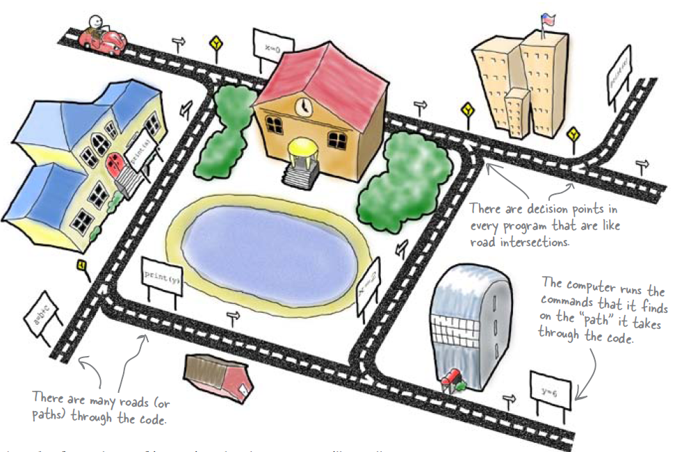

if
==

+ Read integers and print or maior deles

 .. codelens :: image_2

        a = 8
        b = 5
        if a> b:
              print (" A is greatest!")
        if b> a:
              print ("B is the greatest !")

if
==

+ Ler dois valores inteiros e imprimir o maior deles

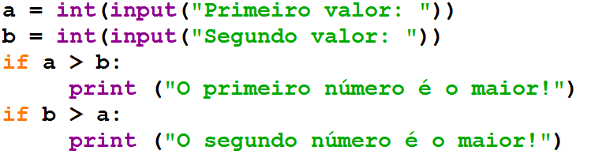

Dois pontos e identação
=======================

if
==

+ Verificar se um carro é novo ou velho
+ Se o carro tiver pelo menos três anos é novo

 .. codelens :: image_3

 	      idade = 10
	      if idade <= 3:
		            print ("Seu carro e novo")
	      if idade> 3:
		            print ("Seu carro e velho")

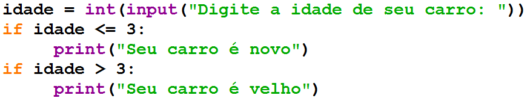

if
==

+ Pergunte a velocidade de um carro, supondo um valor inteiro. Caso
  ultrapasse 110 km/h, exiba uma mensagem dizendo que o usuário foi
  multado. Neste caso, exiba o valor da multa, cobrando R$ 5,00 por km
  acima de 110.

 .. codelens :: image_4

   	    v = 120
  	    if v> 110:
  		        print ("Voce foi fined!")
  		        fine = (v-110) * 5
  		        print ("Value gives fine: R $% 5.2f"% fine)

if
==

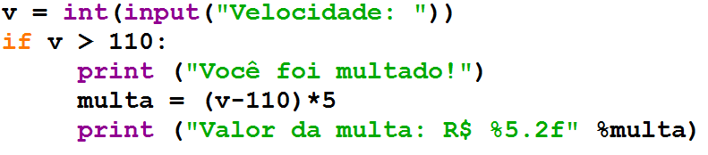

else
====

+ O que fazer quando a condição do if é falsa?
+ Os dois códigos abaixo fazem a mesma coisa:

 .. codelens :: image_5

 	      idade = 1
	      if idade <= 3:
		              print ("Seu carro e novo")
	      if idade> 3:
		              print ("Seu carro e velho")

 .. codelens :: image_6

 	idade = 6
	if idade <= 3:
		print ("Seu carro e novo")
	else:
		print ("Seu carro e velho")

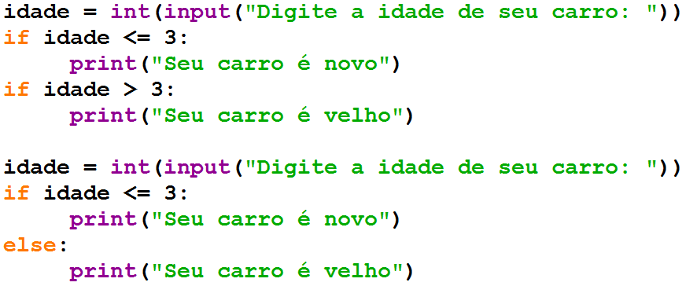

if / else
=========

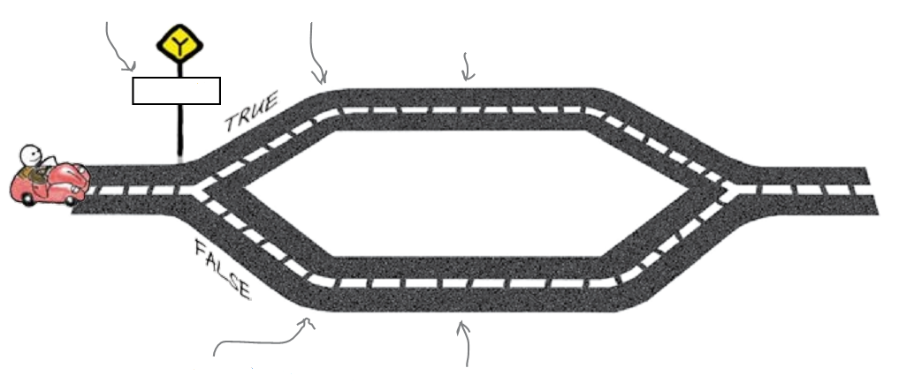

Estrutura aninhadas
===================

+ Considere a empresa de telefonia Tchau. Abaixo de 200 minutos, a
  empresa cobra R$ 0,20 por minuto. Entre 200 e 400 minutos, o preço é
  R$ 0,18. Acima de 400 minutos o preço por minuto é R$ 0,15. Calcule
  sua conta de telefone.

Estruturas aninhadas
====================

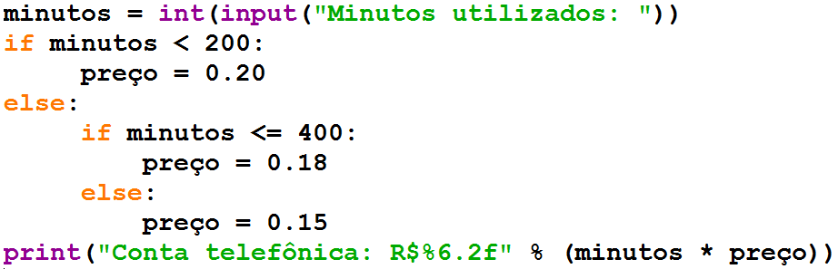

Estruturas aninhadas
====================

 .. codelens :: image_7

 	      minutes = 800
	      if minutes <200:
		              preco = 0.20
	      else:
		              if minutes <= 400:
			                         preco = 0.18
		              else:
			                         preco = 0.15
	print ("Phone number: R $% 6.2f"% (minutes * preco))

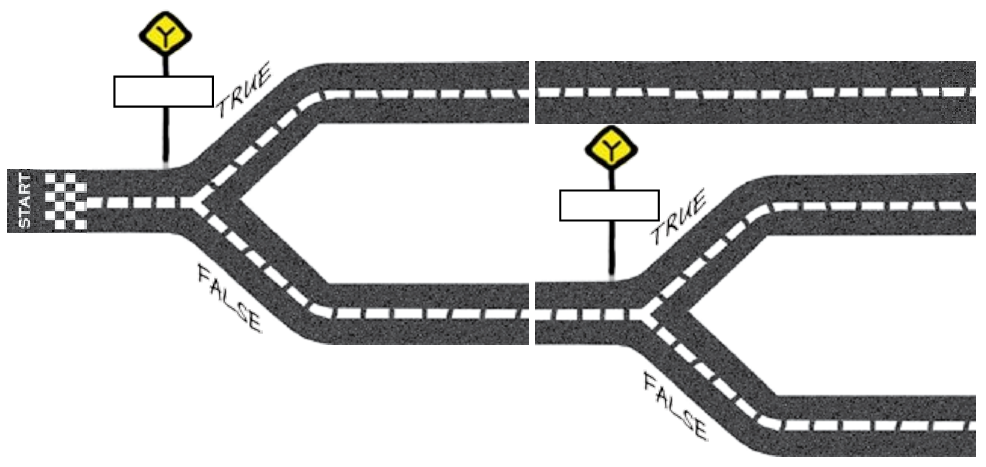

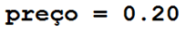

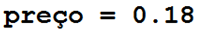

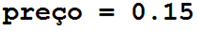

Estruturas aninhadas
====================

+ Modifique o programa da empresa Tchau para uma promoção onde a
  tarifa é de R$ 0,08 quando você utiliza mais que 800 minutos

Estruturas aninhadas
====================

 .. codelens :: image_8

 	      minutes = 1000
	      if minutes <200:
		              preco = 0.2
	      else:
		              if minutes <= 400:
			                       preco = 0.18
		              else:
			                       if minutes <= 800:
				                                  preco = 0.15
			                       else:
				                                  preco = 0.08
	      print ("Phone number: R $% 6.2f"% (minutes * preco))

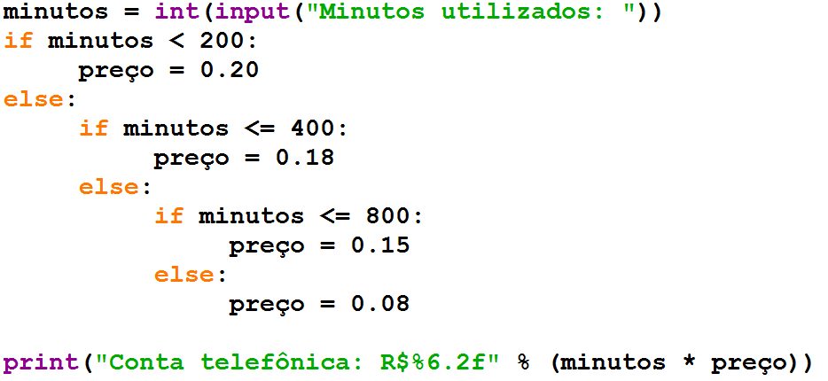

elif
====

+ A cláusula elif substitui um par else if

.. image:: img/TWP10_016.png
   :height: 9cm
   :width: 22.969cm
   :alt:

Lista de Exercícios “again”
===========================

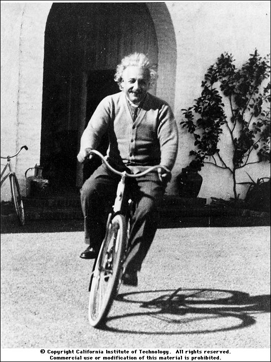
