===============
Revisão Strings
===============

.. image:: img/TWP10_001.jpeg
   :height: 14.925cm
   :width: 9.258cm
   :alt: 

<número>

Texto
=====

+ É difícil comunicar-se sem palavras
+ Entre os vários tipos de dados, um dos mais importantes é o texto ou
  string

  +

    + –Obs.: não é tão fácil manipular strings em algumas linguagens

+ Vamos procurar onde estão as informações num texto == scraping
+ E iremos aprender um dos conceitos mais importantes de orientação à
  objetos: métodos

Starbuzz Café
=============

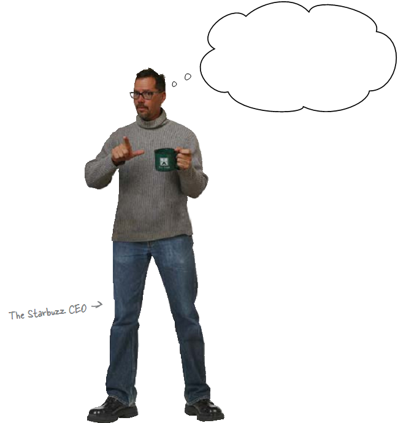

Código Starbuzz atual
=====================

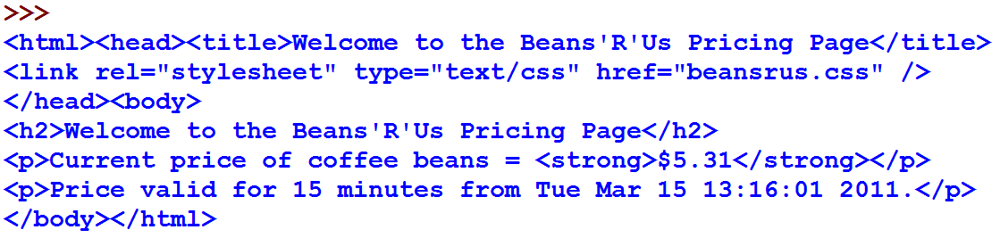

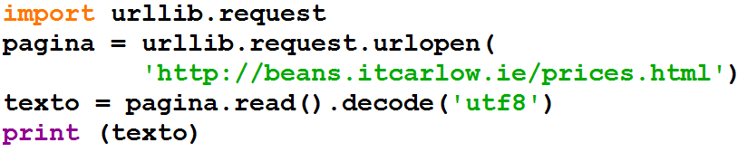

O CEO quer apenas o preço
=========================

O preço está embutido no HTML
=============================

+ Este é um texto HTML “bruto”, que é o formato das páginas Web
+ O preço está embutido no HTML

Strings
=======

+ Strings são seqüências de caracteres

+ Como obter apenas o preço?

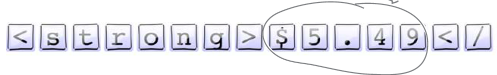

Strings
=======

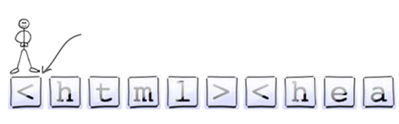

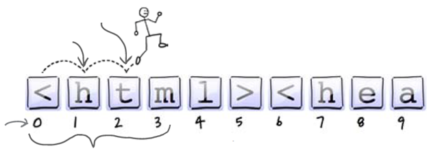

Strings
=======

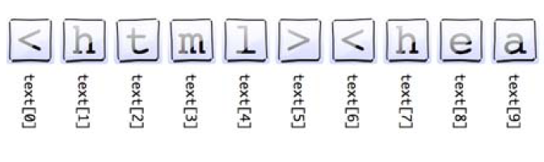

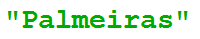

Fatiamento
==========

Fatia do primeiro número até antes do segundo

Não inclui o segundo número!

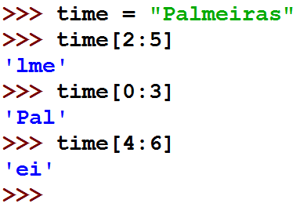

Fatiamento
==========

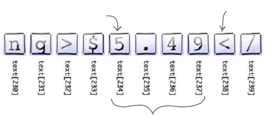

Fatiamento
==========

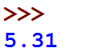

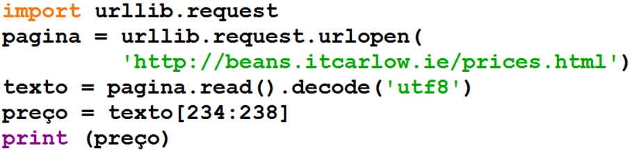

O CEO está feliz!
=================

Não existem perguntas idiotas
=============================

+ Posso colocar qualquer página web neste código?

  +

    + –Sim. Fique à vontade, mas não esqueça o decode
    + –Por exemplo, o site abaixo usa iso8859
    + –`http://www.ime.usp.br/~pf/algoritmos/dicios/br`_

+ O que urllib.request faz?

    + –Permite conversar com a internet

+ Posso acessar uma página diretamente no navegador?

    + –Sim. Digite no modo interativo “import antigravity”

Descontos para clientes fiéis
=============================

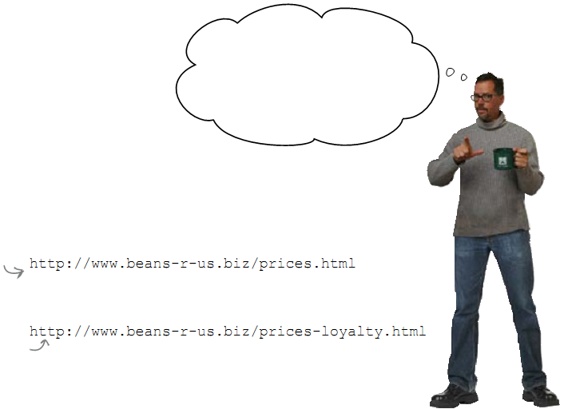

Programa de fidelidade
======================

Não deu certo! Apareceu “bean” no lugar do preço. Por quê será?

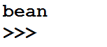

O preço se moveu
================

+ As páginas são diferentes e o preço muda de posição na string

Os dados do Python são 
=======================
espertos

+ As linguagens de programação fornecem uma funcionalidade embutida
  nos dados para ajudá-lo
+ Os dados do Python são espertos: eles podem fazer coisas

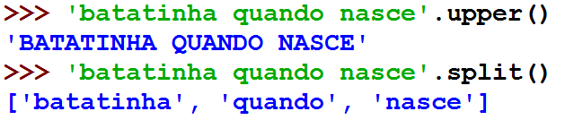

Método find
===========

+ Métodos find para strings

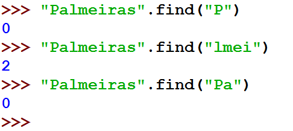

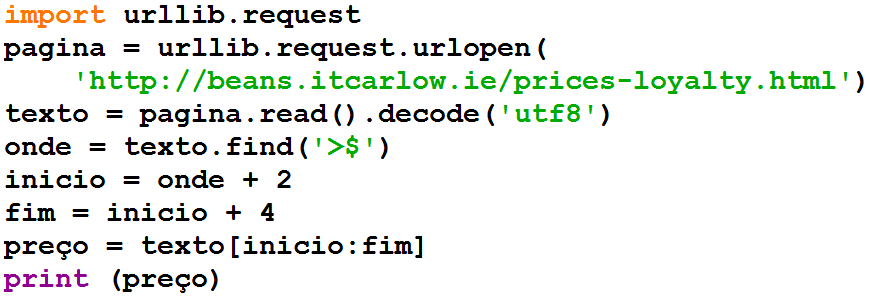

Método find
===========

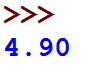

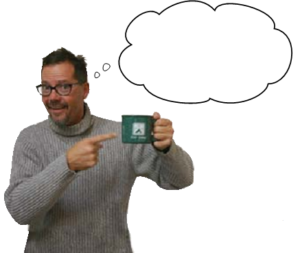

Só quando for menos que 4.74
============================

Só quando for menos que 4.74
============================

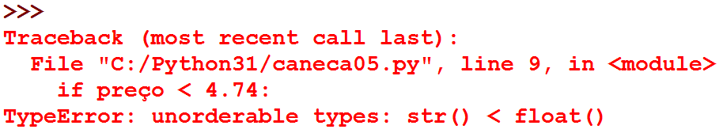

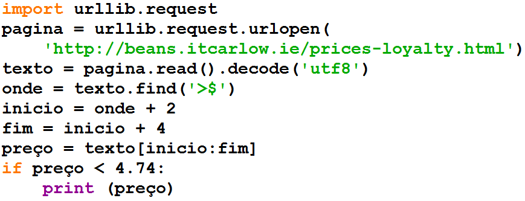

Strings são diferentes de números
=================================

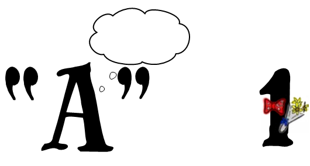

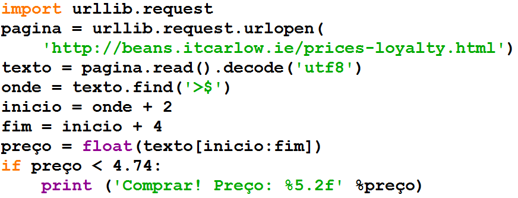

Convertendo para float
======================

Ele pode ficar testando o preço?
================================

Ele pode ficar tentando?
========================

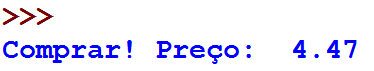

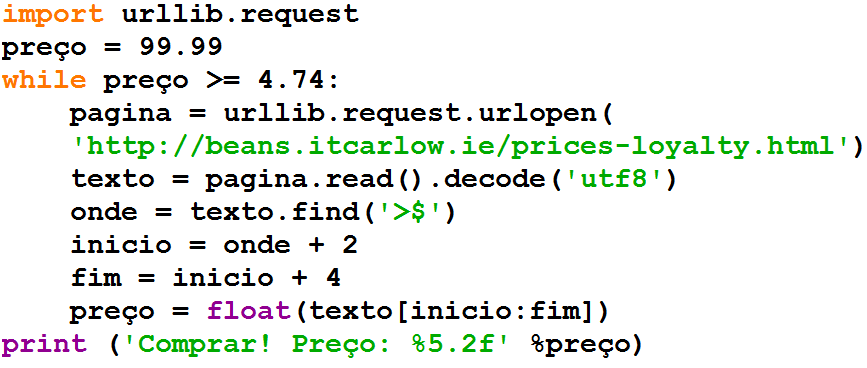

O CEO está muito feliz!
=======================

Aconteceu algum problema
========================

Acusação de DDoS
================

+ DDoS – Distributed Denial of Service

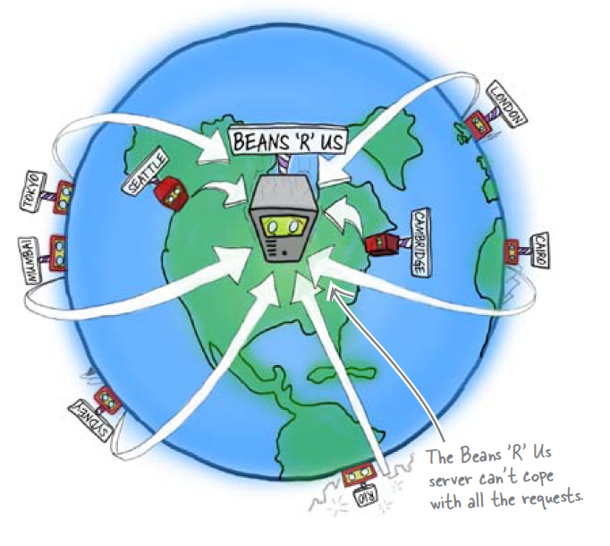

Recebemos uma mensagem
======================

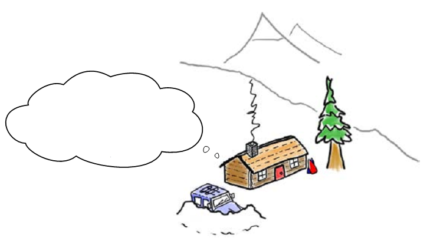

Biblioteca time
===============

+ Hora atual em segundos time.clock()
+ Estou no horário de verão? time.daylight()
+ Dormir alguns segundos time.sleep(secs)
+ Fuso horário time.timezone()

10 minutos entre cada acesso
============================

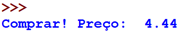

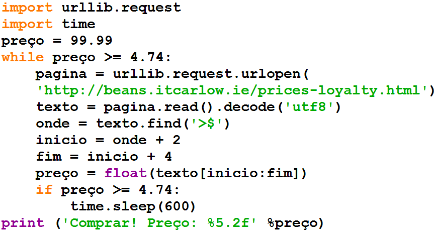

Resumo
======

+ Strings são seqüências de caracteres
+ Acessamos os caracteres individuais pelo índice, que começa com zero
+ Métodos são funções embutidas nas variáveis
+ Existem bibliotecas de programação com código pronto
+ Os dados possuem um tipo, como int ou string

Ferramentas Python
==================

+ texto[4] acessa o 5º caracter
+ texto[4:9] acessa do 5º ao 9º caracter
+ O método texto.find() procura um substring
+ float() converte algo para ponto flutuante
+ Bibliotecas: urllib.request e time

.. _http://www.ime.usp.br/~pf/algoritmos/dicios/br: http://www.ime.usp.br/~pf/algoritmos/dicios/br

