===============
Revisão Geral 2
===============

.. image:: img/TWP10_001.jpeg
   :height: 14.925cm
   :width: 9.258cm
   :alt: 

<número>

O que é um programa?
====================

+ Um conjunto detalhado de instruções, passo a passo, dizendo o que o
  computador fará
+ Se mudamos o programa, o computador fará uma outra coisa diferente
+ O computador permanece o mesmo, mas o programa mudou
+ Programas são executados

O que é um programa?
====================

+ Software (programas) comandam o hardware
+ O processo de criar software chama-se programação
+ Um algoritmo é a receita, passo a passo, que resolve um problema
  computacional

Linguagens de Programação
=========================

+ Linguagens de baixo nível são as mais próximas da máquina
+ Assembler:

  +

    + –Carregue o número da variável A na CPU
    + –Carregue o número da variável B na CPU
    + –Adicione os dois números na CPU
    + –Armazene o resultado na variável C

Linguagens de Programação
=========================

+ Comando original em linguagem de alto nível:

C = A + B

+ Compiladores convertem a linguagem de alto nível para a linguagem de
  máquina específica de um computador
+ Interpretadores analisam e executam o programa instrução por
  instrução na linguagem de máquina

Python
======

+ O sinal “>>>” indica que o Python está “pronto” para receber
  comandos

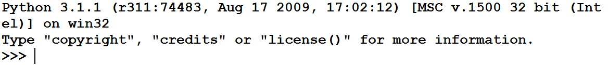

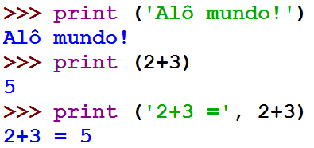

Python
======

+ Normalmente queremos repetir uma série de comandos várias vezes
+ Uma forma de fazer isso é utilizar uma função

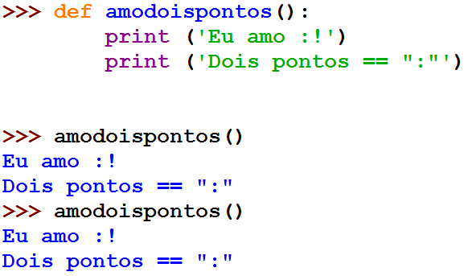

Python
======

+ Não esqueça dos parênteses ao chamar a função!
+ Se você esquecer dos parênteses, o python devolverá o endereço na
  memória onde está o código da função

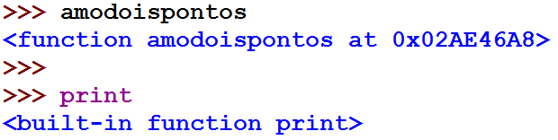

Python
======

+ Podemos colocar parâmetros numa função

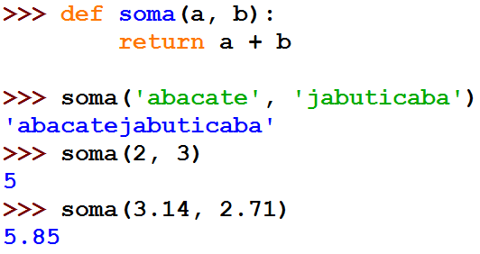

Python
======

+ As funções deixam de existir assim que você sair do interpretador
  Python
+ Por isso, os programas são normalmente compostos de módulos, que são
  arquivos salvos em disco
+ Um módulo é um arquivo texto que contêm um programa python
+ Você pode editar os módulos em uma ambiente de desenvolvimento, que
  realça palavras reservadas, faz identação automática, etc...

Python
======

+ Salvamos um programa chamado caos.py
+ Não esqueça a extenção .py
+ Podemos rodar o programa com a tecla F5

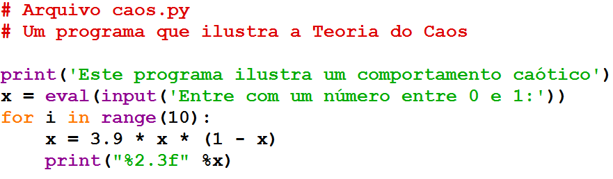

Python
======

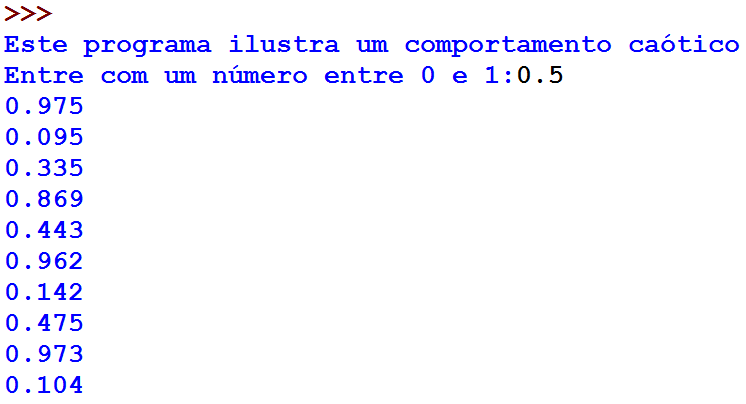

Python
======

+ Linhas que começam com “#” são chamadas de comentários
+ Servem para serem lidas por humanos e são ignoradas pelo Python
+ O Python pula todo o texto do “#” até o fim da linha

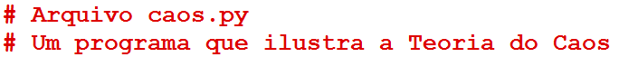

Python
======

+ x é um exemplo de variável
+ Em x atribuiremos um valor que poderá ser referenciado depois
+ A mensagem entre aspas será apresentada e a resposta armazenada em x

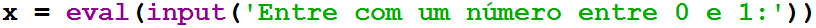

Python
======

+ Existem comandos de loop como o for
+ Um loop serve para repetir várias vezes um bloco de comandos
+ Neste exemplo o bloco seguinte irá ser repetido 10 vezes

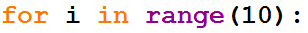

Python
======

+ Chamamos de identação os espaços no início da linha
+ No Python a identação delimita o bloco que será executado
+ O cálculo 3.9*x*(1-x) será executado na CPU e atribuído na variável
  x

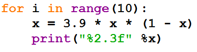

Python
======

+ A função caos devolve valores bem diferentes, mesmo quando a entrada
  é parecida

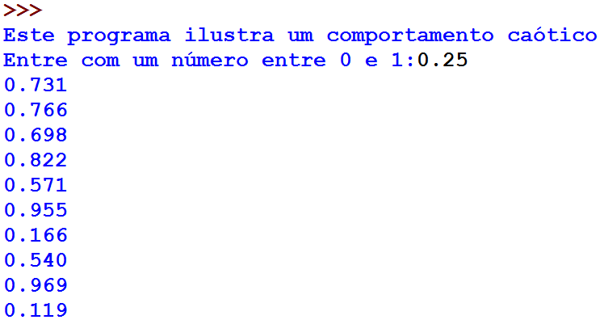

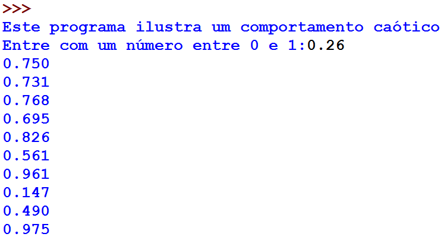

Exercício
=========

+ Altere o programa anterior de forma que leia um valor inteiro n e
  execute o for n vezes no lugar do valor fixo 10

Resumo
======

+ A descrição de uma seqüência de passos para resolver um problema
  computacional é chamada de algoritmo
+ Algoritmos são programas (software) que determinam o que o
  computador (hardware) fará
+ O processo de criar software é chamado de programação

Recordação
==========

+ Linguagens de programação possuem uma sintaxe formal
+ Computadores entendem apenas a linguagem de máquina
+ Python é uma linguagem interpretada de alto nível
+ O interpretador Python converte os comandos instrução por instrução
  para a linguagem de máquina

