=========
Condições
=========

.. image:: img/TWP10_001.jpeg
   :height: 15.125cm
   :width: 9.382cm
   :alt: 

<número>

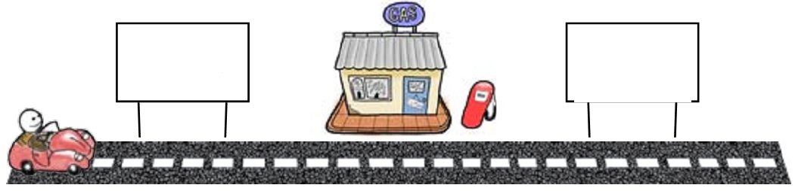

Condições
=========

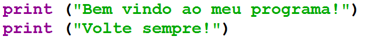

Condições
=========

+ “Executar ou não executar? Eis a questão...”
+ Em geral não executo todas as linhas do programa
+ Passar pelas linhas de um programa é como andar de carro numa cidade
+ Existem pontos onde decidimos qual caminho escolher

Condições
=========

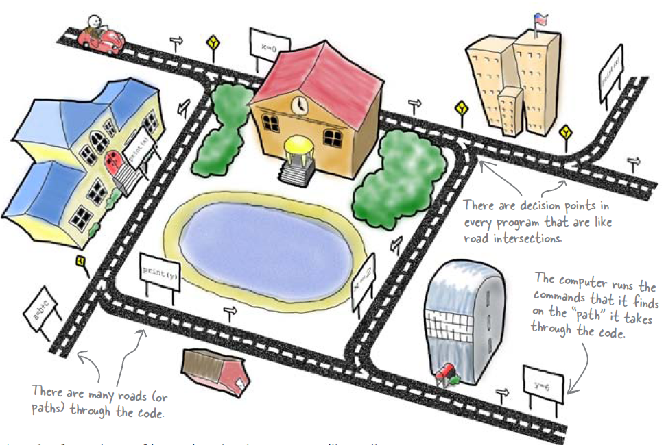

if
==

+ Ler dois valores inteiros e imprimir o maior deles

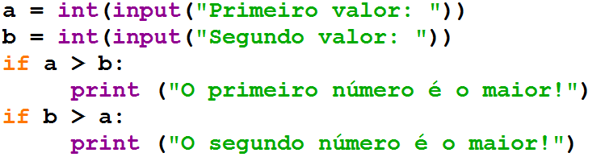

Dois pontos e identação
=======================

if
==

+ Verificar se um carro é novo ou velho
+ Se o carro tiver pelo menos três anos é novo

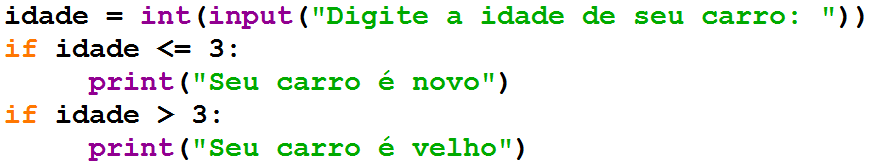

if
==

+ Pergunte a velocidade de um carro, supondo um valor inteiro. Caso
  ultrapasse 110 km/h, exiba uma mensagem dizendo que o usuário foi
  multado. Neste caso, exiba o valor da multa, cobrando R$ 5,00 por km
  acima de 110.

if
==

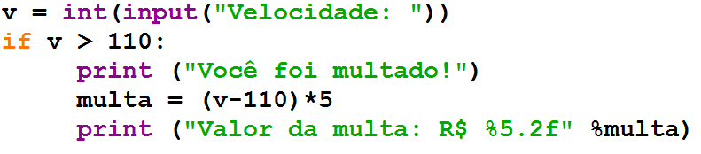

else
====

+ O que fazer quando a condição do if é falsa?
+ Os dois códigos abaixo fazem a mesma coisa:

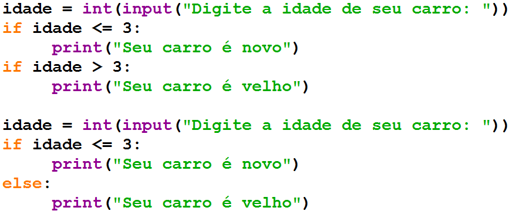

if / else
=========

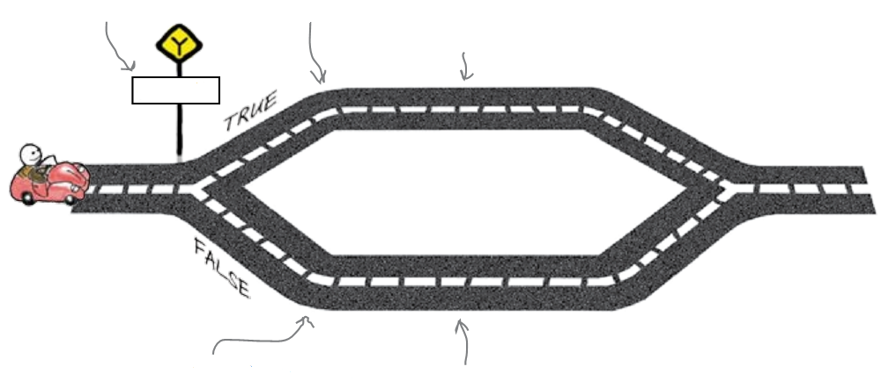

Estrutura aninhadas
===================

+ Considere a empresa de telefonia Tchau. Abaixo de 200 minutos, a
  empresa cobra R$ 0,20 por minuto. Entre 200 e 400 minutos, o preço é
  R$ 0,18. Acima de 400 minutos o preço por minuto é R$ 0,15. Calcule
  sua conta de telefone.

Estruturas aninhadas
====================

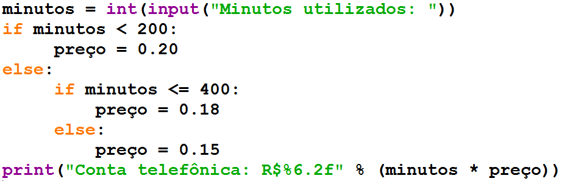

Estruturas aninhadas
====================

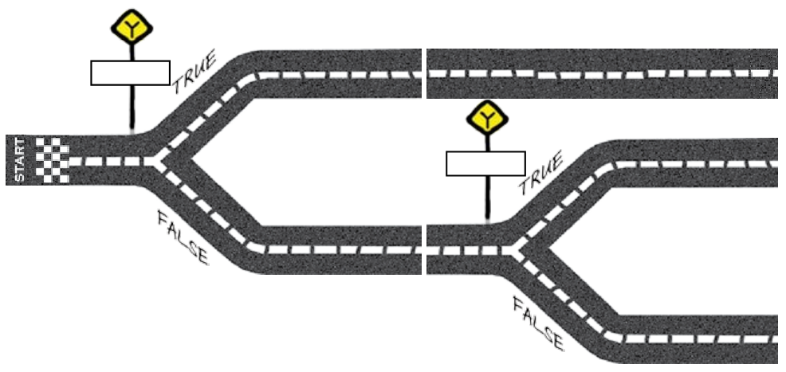

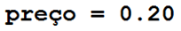

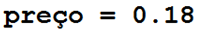

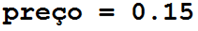

Estruturas aninhadas
====================

+ Modifique o programa da empresa Tchau para uma promoção onde a
  tarifa é de R$ 0,08 quando você utiliza mais que 800 minutos

Estruturas aninhadas
====================

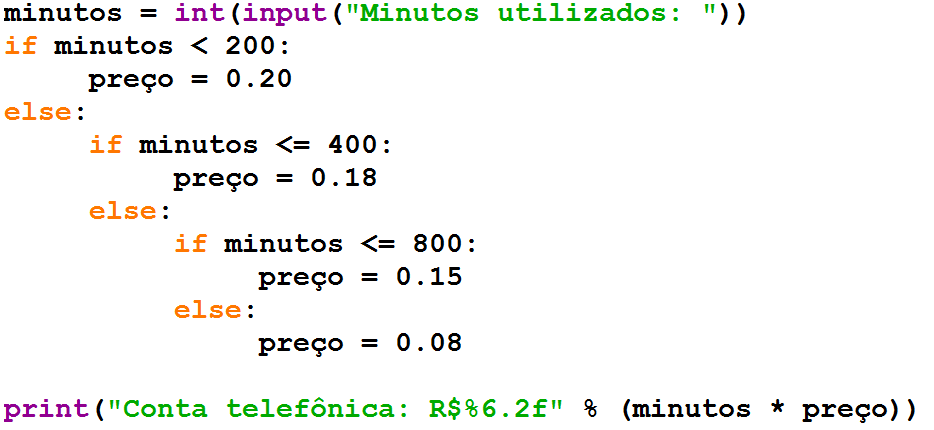

elif
====

+ A cláusula elif substitui um par else if

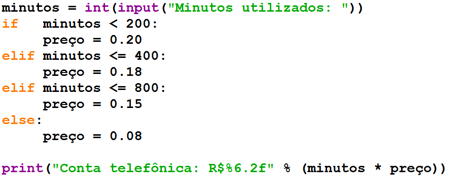

Lista de Exercícios “again”
===========================

.. image:: img/TWP05_041.jpeg
   :height: 12.571cm
   :width: 9.411cm
   :alt: 

