==============
Revisão Listas
==============

.. image:: img/TWP10_001.jpeg
   :height: 14.925cm
   :width: 9.258cm
   :alt: 

<número>

Campeonato de Surf em Codeville
===============================

Campeonato de Surf em Codeville
===============================

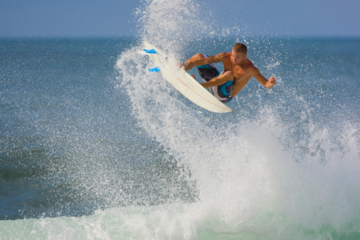

Campeonato de Surf em Codeville
===============================

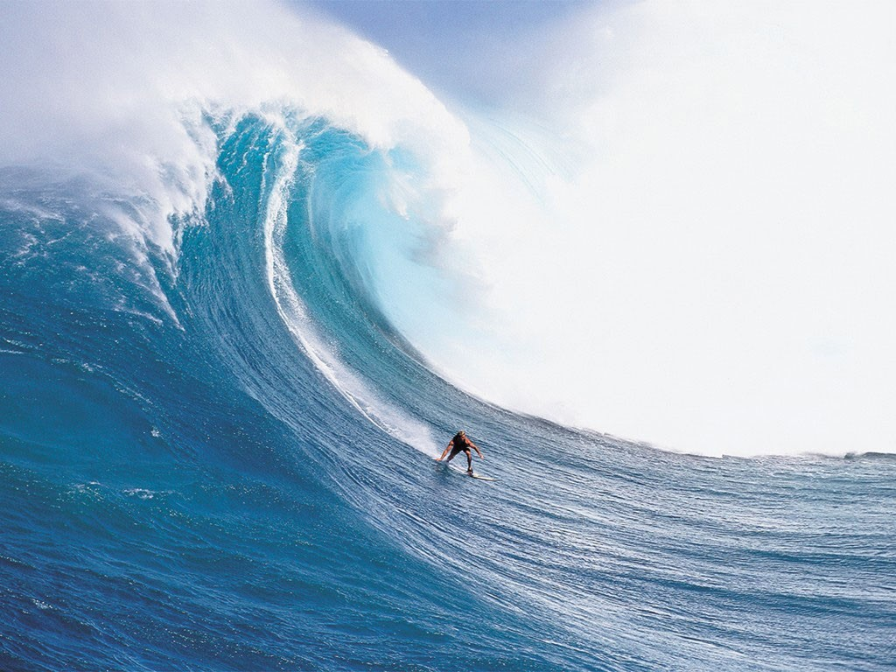

Encontre a pontuação mais alta
==============================

+ As pontuações estão no arquivo surf.txt
+ Selecione a pontuação mais alta para saber o vencedor!

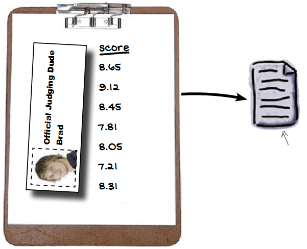

Lendo o arquivo surf.txt
========================

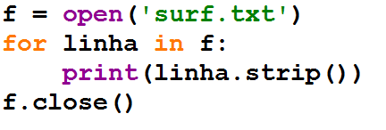

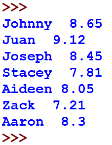

Fragmentador for
================

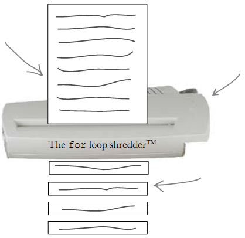

Descubra quem obteve a maior nota
=================================

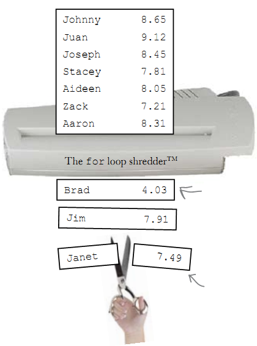

O método split corta a string
=============================

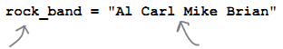

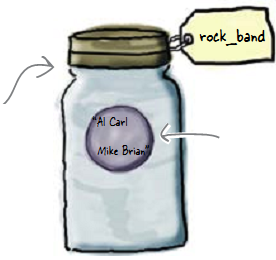

O método split corta a string
=============================

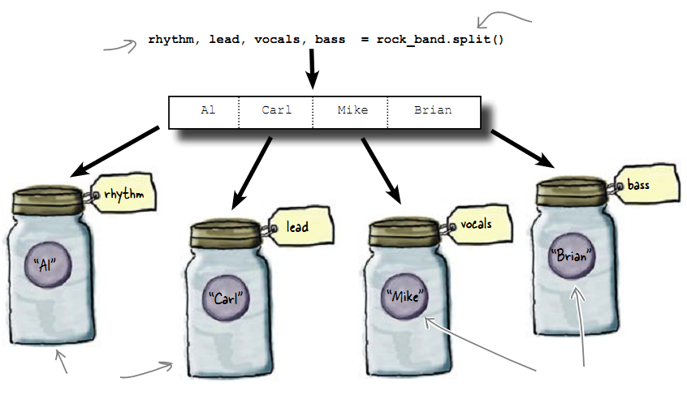

Encontrando o 1º lugar
======================

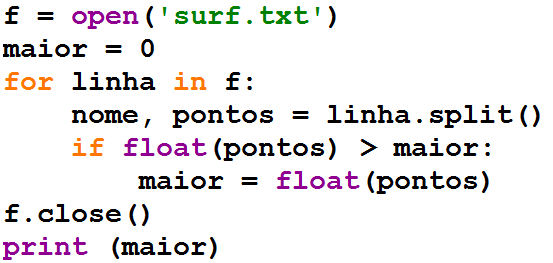

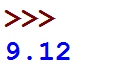

Sai o placar...
===============

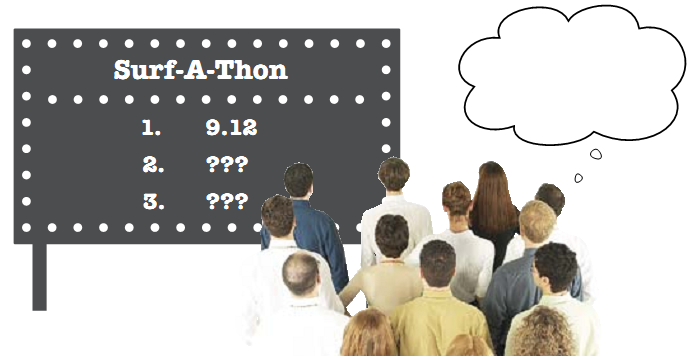

Controlar 3 pontuações é complicado
===================================

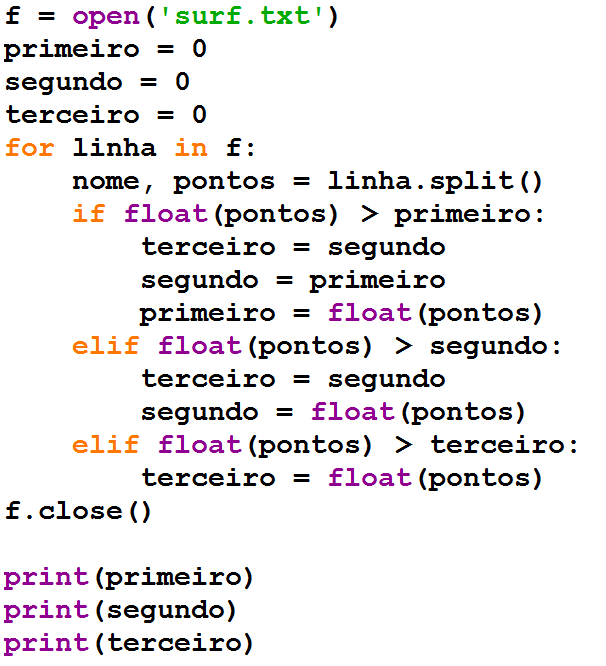

Ordenar a lista seria melhor
============================

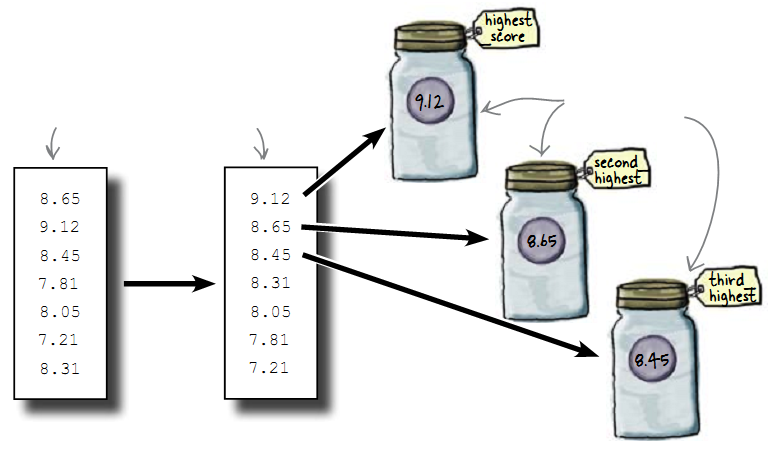

Ordenação é mais fácil na memória
=================================

+ Dados em disco são persistentes: se você puxar o fio da tomada, o
  computador não esquecerá as informações gravadas no disco
+ Dados na memória são muito mais rápidos, porém não são persistentes:
  os dados na memória desaparecem quando seu programa sai ou quando o
  computador é desligado
+ Design Tradeoff: persistência x rapidez

Primeiro: ler os dados para a memória
=====================================

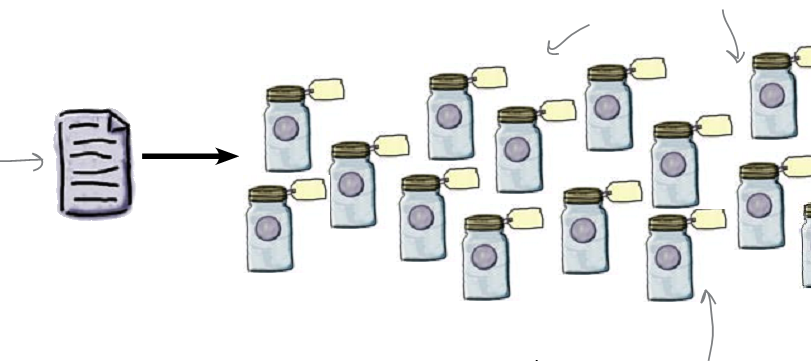

Uai, vamô usar um 
==================
trem de dados
=========

+ Array, lista, vetor são nomes comuns para um lote inteiro de dados
+ Preciso de apenas uma única variável para todo o trem de dados

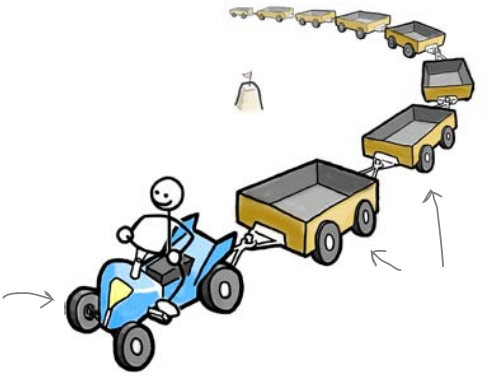

Voltando ao surf...
===================

+ Podemos criar uma lista de notas
+ Para inserir cada nova nota use append
+ Os melhores colocados serão notas[0], notas[1] e notas[2]

Nova classificação
==================

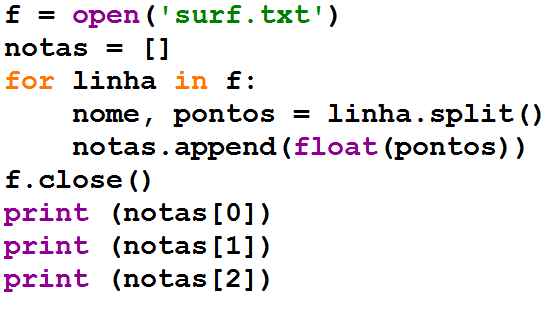

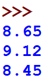

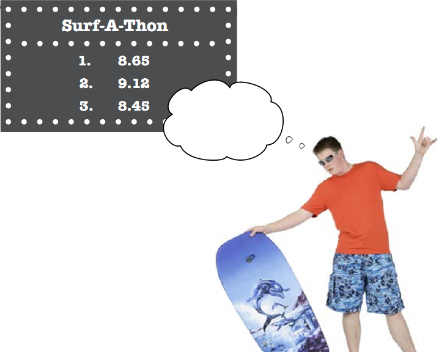

Classificar em ordem descrescente
=================================

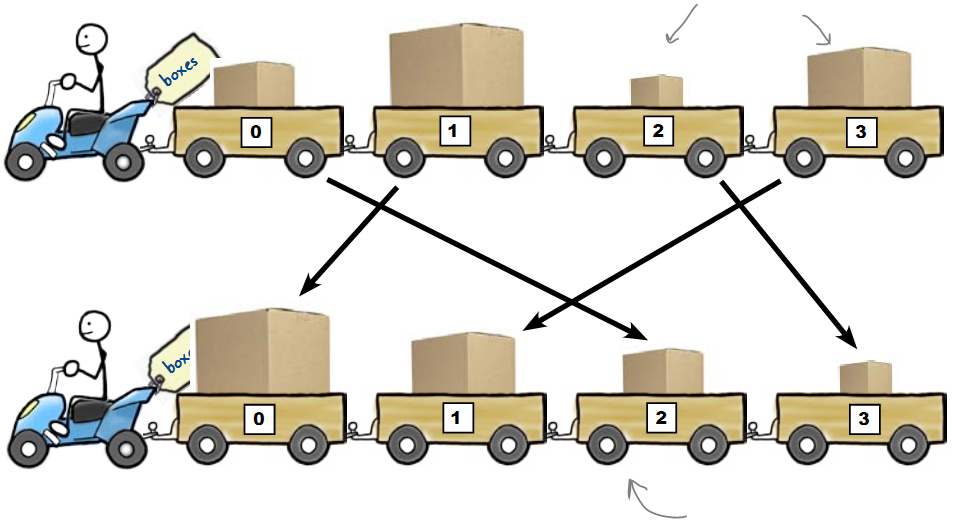

Métodos sort e reverse
======================

+ O método sort ordena os dados
+ Utilizo reverse para que fiquem em ordem descrescente
+ O nerd pode utilizar notas.sort(reverse = True)

Finalmente a classificação correta
==================================

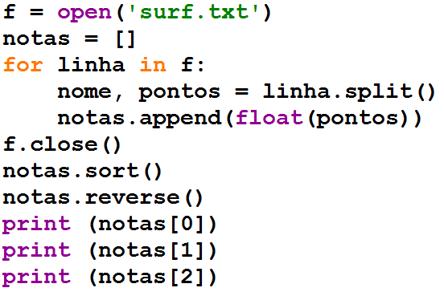

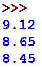

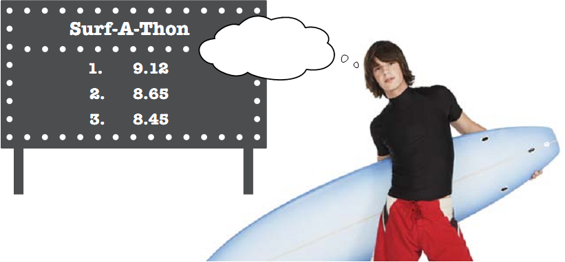

