=======
Módulos
=======

.. image:: img/TWP10_001.jpeg
   :height: 14.925cm
   :width: 9.258cm
   :alt: 

<número>

Programação Modular
===================

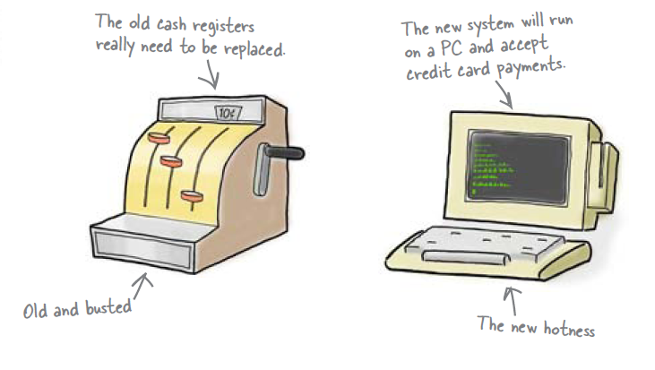

Arquivo transações.txt
======================

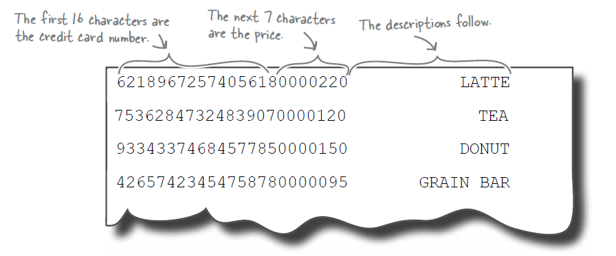

Venda Salgados
==============

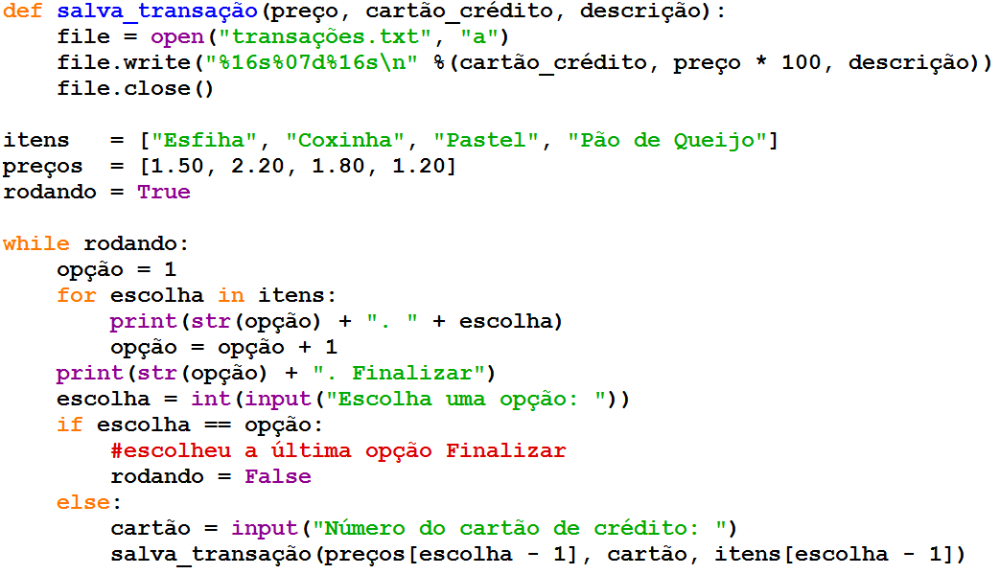

Venda Salgados
==============

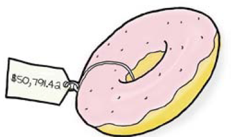

Venda Salgados
==============

+ Problemas: o banco rejeitou todo o arquivo de transações do período
  da manhã!
+ Todos os cartões estavam inválidos
+ Os preços estavam altos demais: rosquinha vendida por R$ 50.791,42!
+ Nos outros períodos não houve problema. O que será que aconteceu?

Venda Salgados
==============

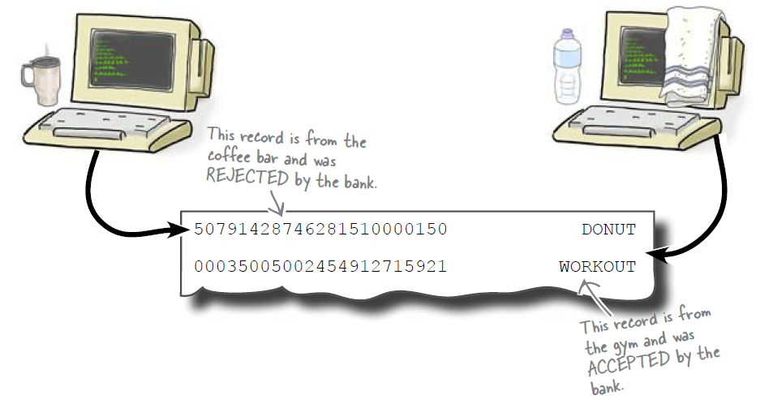

Venda Salgados
==============

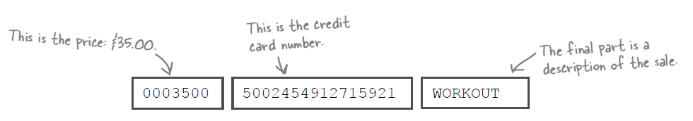

Venda Salgados
==============

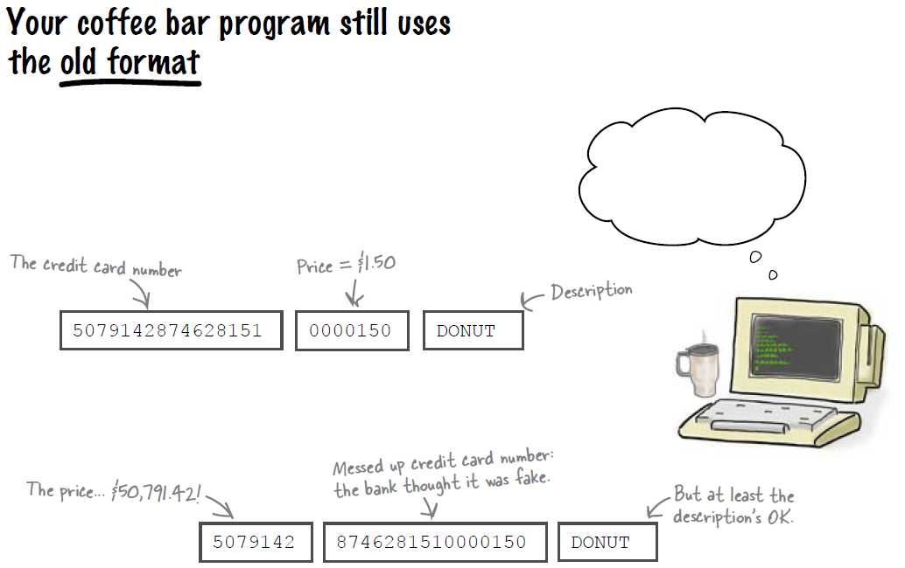

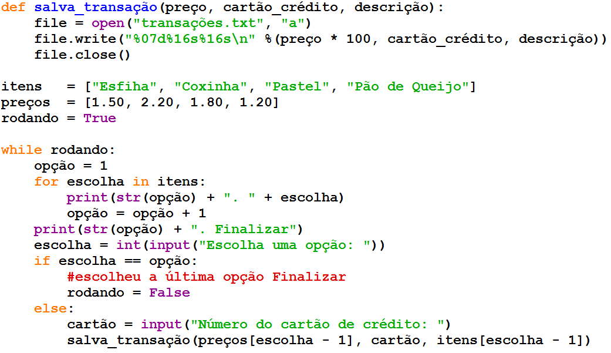

Venda Salgados Tarde/Noite
==========================

Venda Salgados Manhã
====================

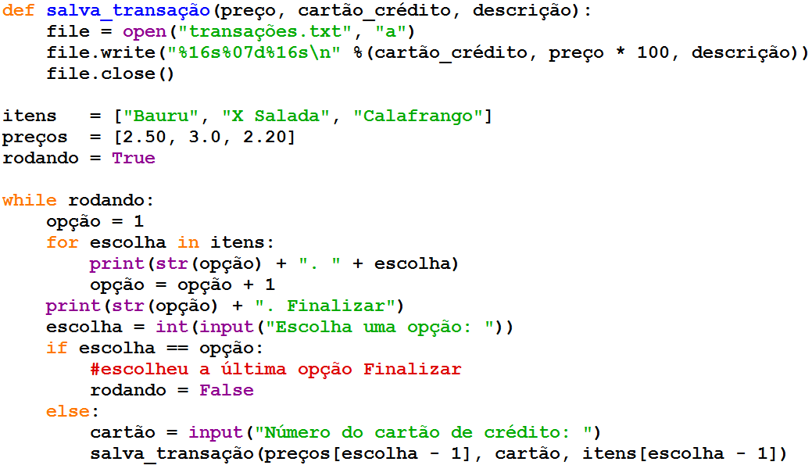

Módulo banco.py
===============

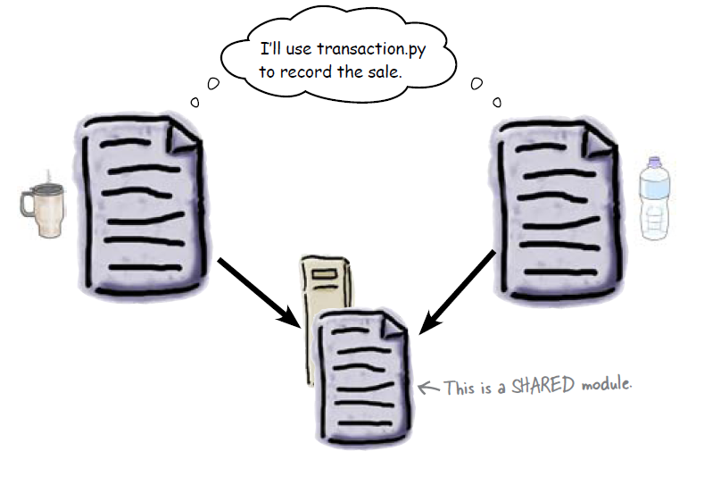

Módulo banco.py
===============

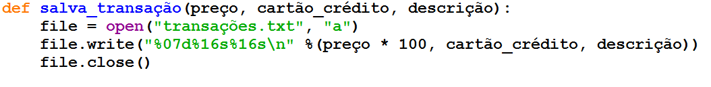

Novo programa da manhã
======================

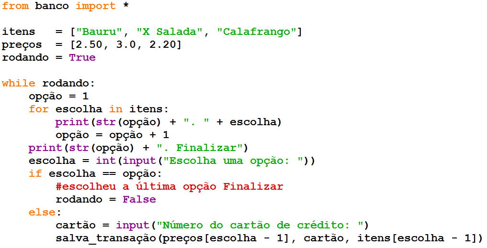

Novo programa tarde/noite
=========================

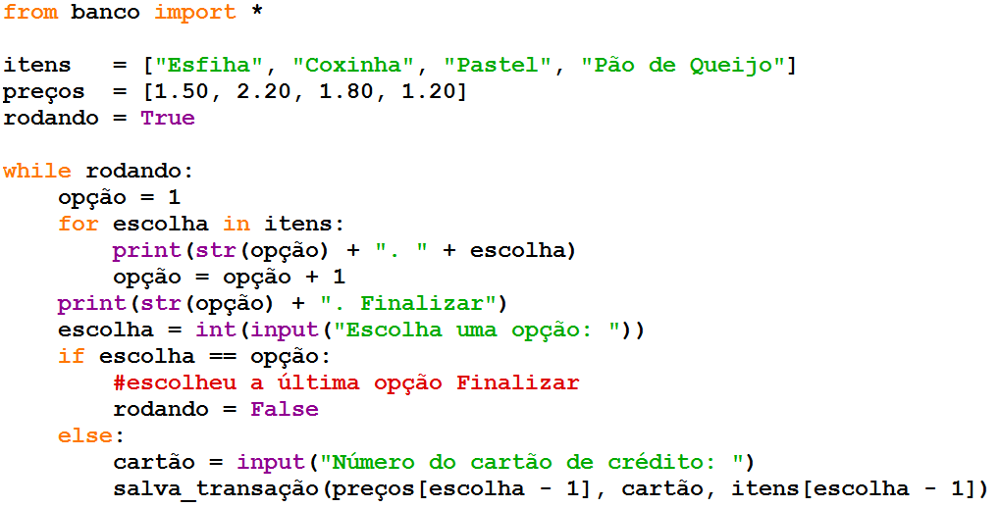

Descontos
=========

+ Agora sob nova direção os salgados na FATEC terão 10% de desconto!
+ Para isso será criado um módulo fatec.py
+ Inicialmente o desconto será de 10% para todos os salgados

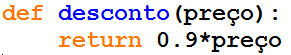

Descontos
=========

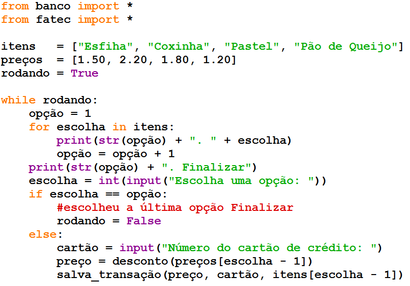

Descontos
=========

+ Teremos um desconto adicional de 50% para pastéis por conta da
  colônia japonesa
+ Novo módulo japa.py

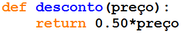

Os nomes são iguais! E agora?
=============================

Nomes Completos
===============

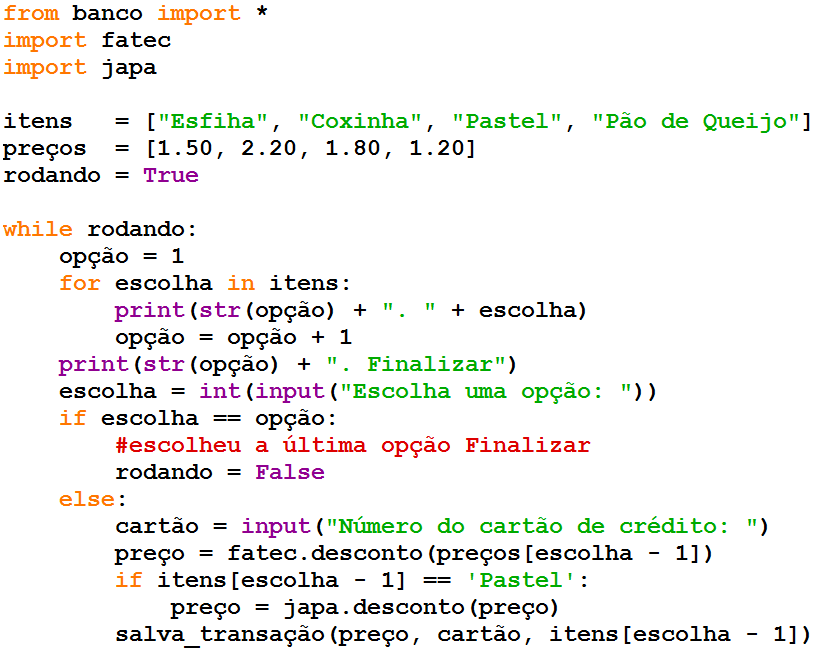

Nomes Completos
===============

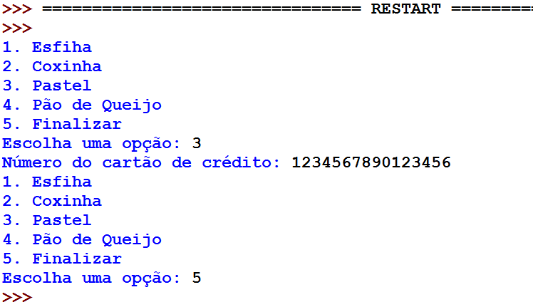

Nomes Completos
===============

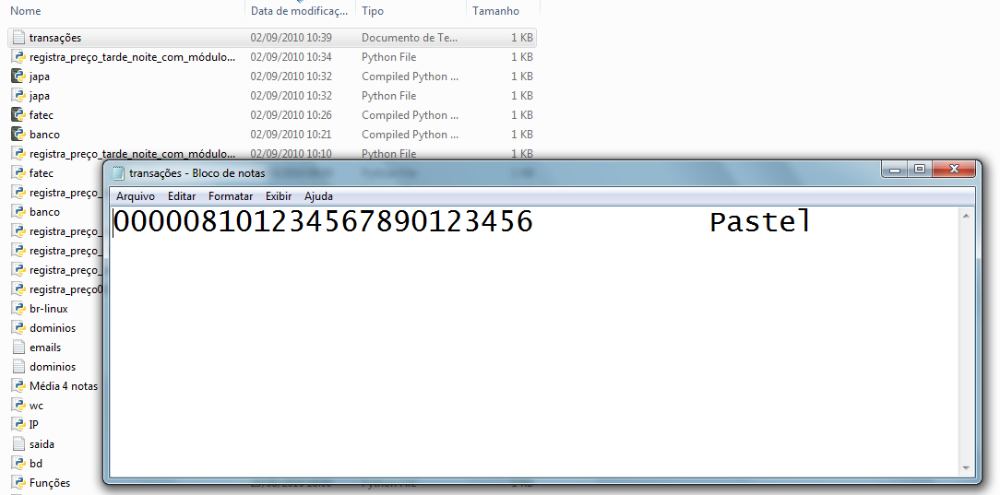

